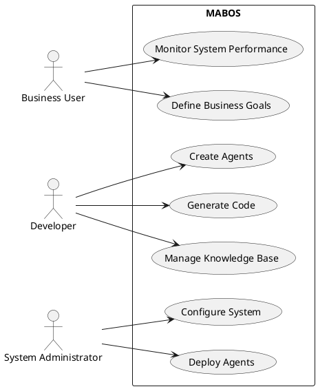
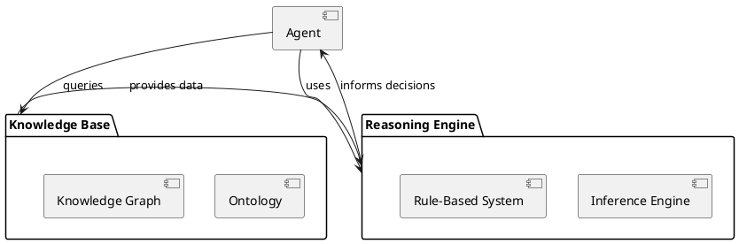
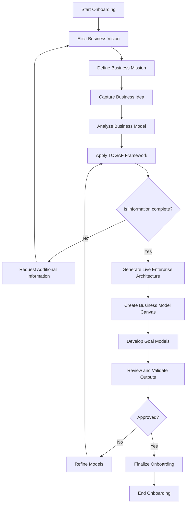
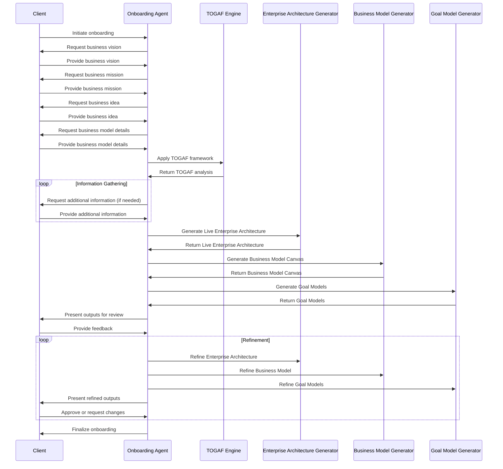

# Multi-Agent System (MAS) Framework for Business Development and Operations

## Table of Contents
1. [Overview](#overview)
2. [Key Components](#key-components)
   - [Agents](#agents)
   - [Communication](#communication)
   - [Knowledge Management](#knowledge-management)
   - [Planning and Reasoning](#planning-and-reasoning)
   - [Environment](#environment)
3. [API Usage Examples](#api-usage-examples)
   - [Creating Different Types of Agents](#creating-different-types-of-agents)
   - [Environmental Agent Updating System State](#environmental-agent-updating-system-state)
   - [Proactive Agent Proposing a Strategy](#proactive-agent-proposing-a-strategy)
   - [Reactive Agent Handling a Customer Query](#reactive-agent-handling-a-customer-query)
   - [Inter-Agent Communication](#inter-agent-communication)
   - [Model-Driven Development (MDD)](#model-driven-development-mdd)
   - [TOGAF Integration](#togaf-integration)
   - [Tropos Framework](#tropos-framework)
   - [Creating a TOGAF Enterprise Architecture](#creating-a-togaf-enterprise-architecture)
   - [Creating a Tropos Model](#creating-a-tropos-model)
   - [Generating MAS from Tropos Model](#generating-mas-from-tropos-model)
4. [Integration of Agent Types](#integration-of-agent-types)
5. [Integration of MDD, TOGAF, and Tropos](#integration-of-mdd-togaf-and-tropos)
6. [Getting Started](#getting-started)
7. [Extending the Framework](#extending-the-framework)
8. [Contributing](#contributing)
9. [License](#license)

## Overview

This Multi-Agent System (MAS) Framework is a sophisticated platform designed for developing complex, goal-oriented, BDI (Belief-Desire-Intention) multi-agent systems. It's specifically tailored for business applications, including business development, operations, intelligence, and performance management.

The framework incorporates advanced features such as:
- Agent Communication Language (ACL) for structured inter-agent communication
- Large Language Model (LLM) integration for natural language processing and human-agent interaction
- Knowledge representation and reasoning capabilities
- Goal management and planning
- Belief revision and update mechanisms
- Environmental, Proactive, and Reactive agent types for comprehensive system behavior
- Model-Driven Development (MDD) approach for system design and implementation
- Integration with TOGAF (The Open Group Architecture Framework) for enterprise architecture alignment
- Incorporation of Tropos framework for agent-oriented software development

___

### Generating Business Domain-Specific MASs
The MABOS API provides a powerful set of endpoints that can be leveraged by a conversational LLM-based BDI (Belief-Desire-Intention) agent to generate business domain-specific Multi-Agent Systems. This process involves several steps, utilizing various endpoints to create a comprehensive MAS tailored to the specific business needs. Here's an overview of how this process works:

1. Business Description Analysis
    The LLM-based agent starts by analyzing the business description provided by the user. It uses its natural language understanding capabilities to extract key information about the business domain, objectives, and requirements.

2. Domain Modeling
    Endpoint: POST /mdd/models
    The agent creates an initial domain model based on the analyzed business description.

3. TOGAF Enterprise Architecture Creation
    Endpoint: POST /togaf/enterprise-architectures
    The agent establishes a high-level enterprise architecture aligned with the business description.

4. Tropos Goal Modeling
    Endpoint: POST /tropos/models
    The agent creates a Tropos model to capture the strategic goals and actor dependencies of the business.

5. Agent Type Identification and Creation
    Endpoints:
    POST /agents/ (for each identified agent type)
    POST /agents/environmental/{agent_id}/update_state
    POST /agents/proactive/{agent_id}/propose_strategy
    POST /agents/reactive/{agent_id}/handle_event

Based on the business needs, the agent identifies and creates appropriate agent types (Environmental, Proactive, Reactive).

6. Knowledge Base Setup
    Endpoint: POST /knowledge_bases/
    The agent creates knowledge bases for each agent, populating them with domain-specific knowledge.

7. Goal Definition
    Endpoint: POST /goals/
    The agent defines specific goals for each agent based on the Tropos model and business objectives.


8. Plan Generation

    Endpoint: POST /planning/plan
    For each goal, the agent generates plans that agents can follow to achieve their objectives.


9. Action and Task Definition
    Endpoints:
    POST /actions/
    POST /tasks/

The agent defines specific actions and tasks that agents need to perform as part of their plans.

10. Communication Protocol Setup
    Endpoints:
    POST /communication/agent/subscribe
    POST /communication/agent/publish

The agent sets up appropriate communication channels and protocols between agents.

11. World Model Integration

    Endpoints:
    PUT /world/state
    POST /world/agents/{agent_id}
    POST /world/objects/{object_id}
    POST /world/relationships

    The agent integrates all components into a cohesive world model.


12. MAS Integration

    Endpoint: POST /integration/tropos-to-mas/{tropos_model_id}
    The agent generates a complete Multi-Agent System based on the Tropos model and all defined components.


13. Alignment and Validation

    Endpoints:
    POST /integration/align-tropos-togaf/{tropos_model_id}/{ea_id}
    POST /integration/align-agents/{ea_id}

    The agent ensures alignment between the generated MAS, the Tropos model, and the TOGAF enterprise architecture.


14. Code Generation

    Endpoint: POST /mdd/models/{model_id}/generate
    Finally, the agent generates executable code for the MAS based on the integrated model.


Throughout this process, the LLM-based agent uses its reasoning capabilities to make decisions about the best way to structure the MAS based on the business description. It can engage in a dialogue with the user, asking for clarifications or additional information when needed, and explaining its decisions.

The agent can also use endpoints like GET /knowledge_bases/{kb_id} to retrieve information, POST /knowledge_bases/{kb_id}/reason to perform reasoning tasks, and POST /knowledge_bases/{kb_id}/query to answer specific questions about the domain or the generated MAS.
This approach allows for the creation of highly customized, business-specific Multi-Agent Systems that are well-aligned with the organization's goals and architecture, all driven by the intelligent decision-making of the LLM-based BDI agent.

## Key Components

### 1. Agents

Agents are the core entities in the system. Each agent has:
- Beliefs: The agent's understanding of the world
- Desires: The agent's goals
- Intentions: The agent's committed plans to achieve its goals

Our framework supports three main types of agents:

#### a. Environmental Agents
- **Role**: Manage and monitor the environment in which other agents operate.
- **Functions**:
  - Context Provision: Gather and disseminate information about the current state of the environment.
  - State Monitoring: Continuously monitor for changes and update other agents.
  - Facilitating Interaction: Provide a shared context for agent coordination.

#### b. Proactive Agents
- **Role**: Take initiative and act in anticipation of future goals or problems.
- **Functions**:
  - Goal Pursuit: Continuously work towards achieving goals.
  - Opportunity Identification: Identify and exploit opportunities aligned with goals.
  - Long-term Planning: Engage in strategic planning for future objectives.

#### c. Reactive Agents
- **Role**: Respond to changes and events in the environment in real-time.
- **Functions**:
  - Event Handling: Respond to specific events or changes quickly.
  - Short-term Actions: Focus on immediate actions to address current situations.
  - Adaptability: Ensure the system can adapt to unexpected changes.

### 2. Communication

The framework supports two types of communication:
- Agent-to-Agent: Using ACL (Agent Communication Language)
- Agent-to-Human: Using LLMs for natural language interaction


### 3. Knowledge Management

- Knowledge Base: Stores and manages the agent's knowledge
- Ontology: Defines the structure and relationships of concepts in the domain


### 4. Planning and Reasoning

- Goal Management: Handles the creation, prioritization, and achievement of goals
- Plan Library: Stores and retrieves plans for achieving goals
- Reasoning Engine: Performs inference and decision-making based on the agent's knowledge and goals


### 5. Environment

Represents the world in which agents operate, including other agents and external systems.

## API Usage Examples

### 1. Creating Different Types of Agents

```python
from app.services.agent_service import AgentService
from app.models.agent import EnvironmentalAgent, ProactiveAgent, ReactiveAgent

agent_service = AgentService()

# Create an Environmental Agent
env_agent = EnvironmentalAgent(
    name="Market Monitor",
    capabilities=["market_analysis", "data_collection"],
    initial_beliefs={"market_state": "stable"}
)
created_env_agent = agent_service.create_agent(env_agent)

# Create a Proactive Agent
proactive_agent = ProactiveAgent(
    name="Business Strategist",
    capabilities=["trend_analysis", "strategy_formulation"],
    initial_beliefs={"long_term_goal": "market_expansion"}
)
created_proactive_agent = agent_service.create_agent(proactive_agent)

# Create a Reactive Agent
reactive_agent = ReactiveAgent(
    name="Customer Service Rep",
    capabilities=["query_handling", "issue_resolution"],
    initial_beliefs={"response_time_target": "2_minutes"}
)
created_reactive_agent = agent_service.create_agent(reactive_agent)
```

### 2. Environmental Agent Updating System State

```python
from app.services.environment_service import EnvironmentService

env_service = EnvironmentService()

new_market_data = {
    "market_trend": "growing",
    "competitor_activity": "increasing",
    "customer_demand": "high"
}

env_service.update_environment_state(created_env_agent.id, new_market_data)
```

### 3. Proactive Agent Proposing a Strategy

```python
from app.services.strategy_service import StrategyService

strategy_service = StrategyService()

new_strategy = {
    "name": "Market Expansion Initiative",
    "description": "Expand into neighboring markets to capitalize on growing demand",
    "timeline": "12_months",
    "expected_roi": 0.15
}

proposed_strategy = strategy_service.propose_strategy(created_proactive_agent.id, new_strategy)
```

### 4. Reactive Agent Handling a Customer Query

```python
from app.services.customer_service import CustomerServiceHandler

cs_handler = CustomerServiceHandler()

customer_query = {
    "customer_id": "CUST123",
    "query_type": "product_information",
    "product_id": "PROD456"
}

response = cs_handler.handle_customer_query(created_reactive_agent.id, customer_query)
```

### 5. Inter-Agent Communication

```python
from app.services.agent_communication_service import AgentCommunicationService
from app.models.message import Performative

comm_service = AgentCommunicationService()

# Environmental Agent informing Proactive Agent about a market change
market_update = {
    "event": "new_competitor_entry",
    "impact": "moderate",
    "affected_markets": ["Region A", "Region B"]
}

comm_service.send_message(
    sender_id=created_env_agent.id,
    receiver_id=created_proactive_agent.id,
    performative=Performative.INFORM,
    content=market_update
)

# Proactive Agent requesting action from Reactive Agent
action_request = {
    "action": "customer_outreach",
    "target_segment": "high_value_customers",
    "message": "Inform about our competitive advantage"
}

comm_service.send_message(
    sender_id=created_proactive_agent.id,
    receiver_id=created_reactive_agent.id,
    performative=Performative.REQUEST,
    content=action_request
)
```

### 6. Model-Driven Development (MDD)

The framework now supports a comprehensive MDD approach, allowing for:
- High-level modeling of the multi-agent system
- Automatic code generation from models
- Model transformation between different abstraction levels
- Validation and verification of models

### 7. TOGAF Integration

The framework incorporates TOGAF concepts for enterprise architecture:
- Business Architecture: Aligning agent goals with business objectives
- Data Architecture: Modeling knowledge bases and information flow
- Application Architecture: Designing agent interactions and system components
- Technology Architecture: Specifying the technical environment for the MAS

### 8. Tropos Framework

Tropos concepts are integrated for agent-oriented software development:
- Actor modeling: Representing stakeholders and system actors
- Goal modeling: Capturing and analyzing system goals
- Dependency modeling: Expressing relationships between actors
- Plan modeling: Detailing how goals are achieved

## API Usage Examples

### 1. Creating Different Types of Agents

```python
from app.services.agent_service import AgentService
from app.models.agent import EnvironmentalAgent, ProactiveAgent, ReactiveAgent

agent_service = AgentService()

# Create an Environmental Agent
env_agent = EnvironmentalAgent(
    name="Market Monitor",
    capabilities=["market_analysis", "data_collection"],
    initial_beliefs={"market_state": "stable"}
)
created_env_agent = agent_service.create_agent(env_agent)

# Create a Proactive Agent
proactive_agent = ProactiveAgent(
    name="Business Strategist",
    capabilities=["trend_analysis", "strategy_formulation"],
    initial_beliefs={"long_term_goal": "market_expansion"}
)
created_proactive_agent = agent_service.create_agent(proactive_agent)

# Create a Reactive Agent
reactive_agent = ReactiveAgent(
    name="Customer Service Rep",
    capabilities=["query_handling", "issue_resolution"],
    initial_beliefs={"response_time_target": "2_minutes"}
)
created_reactive_agent = agent_service.create_agent(reactive_agent)
```

### 2. Environmental Agent Updating System State

```python
from app.services.environment_service import EnvironmentService

env_service = EnvironmentService()

new_market_data = {
    "market_trend": "growing",
    "competitor_activity": "increasing",
    "customer_demand": "high"
}

env_service.update_environment_state(created_env_agent.id, new_market_data)
```

### 3. Proactive Agent Proposing a Strategy

```python
from app.services.strategy_service import StrategyService

strategy_service = StrategyService()

new_strategy = {
    "name": "Market Expansion Initiative",
    "description": "Expand into neighboring markets to capitalize on growing demand",
    "timeline": "12_months",
    "expected_roi": 0.15
}

proposed_strategy = strategy_service.propose_strategy(created_proactive_agent.id, new_strategy)
```

### 4. Reactive Agent Handling a Customer Query

```python
from app.services.customer_service import CustomerServiceHandler

cs_handler = CustomerServiceHandler()

customer_query = {
    "customer_id": "CUST123",
    "query_type": "product_information",
    "product_id": "PROD456"
}

response = cs_handler.handle_customer_query(created_reactive_agent.id, customer_query)
```

### 5. Inter-Agent Communication

```python
from app.services.agent_communication_service import AgentCommunicationService
from app.models.message import Performative

comm_service = AgentCommunicationService()

# Environmental Agent informing Proactive Agent about a market change
market_update = {
    "event": "new_competitor_entry",
    "impact": "moderate",
    "affected_markets": ["Region A", "Region B"]
}

comm_service.send_message(
    sender_id=created_env_agent.id,
    receiver_id=created_proactive_agent.id,
    performative=Performative.INFORM,
    content=market_update
)

# Proactive Agent requesting action from Reactive Agent
action_request = {
    "action": "customer_outreach",
    "target_segment": "high_value_customers",
    "message": "Inform about our competitive advantage"
}

comm_service.send_message(
    sender_id=created_proactive_agent.id,
    receiver_id=created_reactive_agent.id,
    performative=Performative.REQUEST,
    content=action_request
)
```
## Integration of Agent Types

In our BDI Multi-Agent System, the different agent types work together to achieve business objectives:

1. **Environmental Agents** (e.g., Market Monitor) continuously update the system's understanding of the business environment. They provide crucial information to both Proactive and Reactive agents.

2. **Proactive Agents** (e.g., Business Strategist) use the information from Environmental Agents to formulate long-term strategies and identify opportunities. They may issue requests to Reactive Agents for specific actions that align with these strategies.

3. **Reactive Agents** (e.g., Customer Service Rep) handle immediate tasks and respond to real-time events. They may receive strategic guidance from Proactive Agents and use context provided by Environmental Agents to inform their actions.

This integration ensures that the system can balance long-term strategic planning with immediate responsiveness, leveraging the strengths of each agent type to achieve business objectives effectively.


### 6. Creating a TOGAF Enterprise Architecture

```python
from app.services.togaf_service import TOGAFService
from app.models.togaf_models import EnterpriseArchitecture, BusinessService, TechnologyService

togaf_service = TOGAFService()

# Create an Enterprise Architecture
ea = EnterpriseArchitecture(
    name="Global Expansion Architecture",
    description="Architecture for international market expansion"
)
created_ea = togaf_service.create_enterprise_architecture(ea)

# Add a Business Service
business_service = BusinessService(
    name="Market Entry Service",
    processes=["market analysis", "regulatory compliance", "local partnership establishment"],
    stakeholders=["Business Development", "Legal", "Finance"]
)
updated_ea = togaf_service.add_business_service(created_ea.id, business_service)

# Add a Technology Service
technology_service = TechnologyService(
    name="Cross-Border Transaction Platform",
    infrastructure_components=["payment gateway", "currency conversion", "fraud detection"],
    platforms=["cloud-based", "mobile-friendly"]
)
updated_ea = togaf_service.add_technology_service(created_ea.id, technology_service)
```
### 7. Creating a Tropos Model

```python
from app.services.tropos_service import TroposService
from app.models.tropos_models import TroposModel, Actor, Dependency

tropos_service = TroposService()

# Create a Tropos Model
tropos_model = TroposModel(
    name="Market Expansion Model",
    description="Agent-oriented model for market expansion strategy"
)
created_model = tropos_service.create_tropos_model(tropos_model)

# Add an Actor
business_strategist = Actor(
    name="Business Strategist",
    type="Agent",
    goals=["identify new markets", "develop entry strategies"],
    softgoals=["minimize risk", "maximize ROI"]
)
updated_model = tropos_service.add_actor(created_model.id, business_strategist)

# Add a Dependency
market_data_dependency = Dependency(
    name="Accurate Market Data",
    type="Resource",
    depender=business_strategist.id,
    dependee=market_analyst.id  # Assuming market_analyst is another actor
)
updated_model = tropos_service.add_dependency(created_model.id, market_data_dependency)
```

### 8. Generating MAS from Tropos Model

```python
from app.services.tropos_mas_integration_service import TroposMASIntegrationService

integration_service = TroposMASIntegrationService()

# Generate MAS from Tropos Model
mas = integration_service.generate_mas_from_tropos(created_model.id)
```

## Integration of MDD, TOGAF, and Tropos

The framework now provides a seamless integration between MDD, TOGAF, and Tropos:

1. **TOGAF Enterprise Architecture** provides the overall business and technology context.
2. **Tropos Models** define the agent-oriented aspects of the system within this context.
3. **MDD Approach** is used to transform high-level Tropos and TOGAF models into implementable MAS designs.
4. **Multi-Agent System** is generated and aligned with both the enterprise architecture and agent-oriented models.

This integration ensures that the resulting MAS is:
- Aligned with business goals and enterprise architecture (TOGAF)
- Designed with a focus on agent interactions and goals (Tropos)
- Consistently implemented through model transformations (MDD)

## Getting Started

. Clone the repository:
   ```
   git clone https://github.com/your-repo/mas-framework.git
   ```

2. Install dependencies:
   ```
   pip install -r requirements.txt
   ```

3. Set up your environment variables:
   ```
   cp .env.example .env
   # Edit .env with your specific configurations
   ```

4. Run the application:
   ```
   uvicorn app.main:app --reload
   ```

5. Access the API documentation:
   Open your browser and go to `http://localhost:8000/docs` to see the Swagger UI with all available endpoints.

## Extending the Framework

To extend the framework for your specific use case:

1. Define your domain-specific ontology in `app/models/ontology.py`
2. Create custom agent types by extending the base `EnvironmentalAgent`, `ProactiveAgent`, or `ReactiveAgent` classes
3. Implement domain-specific reasoning rules in the `ReasoningEngine`
4. Develop custom plans and add them to the `PlanLibrary`
5. Integrate with external systems and data sources as needed
6. Create TOGAF models to align your MAS with enterprise architecture
7. Develop Tropos models to capture agent-oriented aspects of your system
8. Implement custom model transformations for your specific domain

___
## System Architecture Diagrams
System architecture diagrams to represent the MABOS architecture based on TOGAF, state machines, data class models, activity diagrams, sequence diagrams, and use case diagrams. I'll also highlight the knowledge management, reasoning, and inference capabilities of the MAS, illustrating the use of ontologies and knowledge graphs for knowledge representation in MAS agents.

Here's an updated section for the README with these diagrams:

## System Architecture Diagrams

### TOGAF-based Enterprise Architecture

```plantuml
@startuml MABOS Enterprise Architecture
!include https://raw.githubusercontent.com/plantuml-stdlib/C4-PlantUML/master/C4_Context.puml

title MABOS Enterprise Architecture (TOGAF-based)

Enterprise_Boundary(eb, "MABOS Enterprise") {
    System_Boundary(sb, "MABOS Platform") {
        System(mas, "Multi-Agent System", "Core system for goal-oriented agents")
        System(kb, "Knowledge Base", "Ontology and knowledge graph storage")
        System(re, "Reasoning Engine", "Inference and decision-making component")
        System(mdd, "Model-Driven Development", "Automated code generation and model transformation")
        System(togaf, "TOGAF Integration", "Enterprise architecture alignment")
        System(tropos, "Tropos Framework", "Goal-oriented requirement analysis")
    }
    
    System_Ext(ext_sys, "External Systems", "Business systems and data sources")
    Person(business_user, "Business User", "Defines goals and interacts with the system")
    
    Rel(business_user, mas, "Interacts with")
    Rel(mas, kb, "Utilizes")
    Rel(mas, re, "Uses for decision-making")
    Rel(mas, mdd, "Generates code and models")
    Rel(mas, togaf, "Aligns with")
    Rel(mas, tropos, "Defines goals using")
    Rel(mas, ext_sys, "Integrates with")
}
@enduml
```
---

### MAS State Machine


---

### Data Class Model


---

### Activity Diagram: Goal Processing


---

### Sequence Diagram: Inter-Agent Communication


---

### Use Case Diagram


---

### Knowledge Management and Reasoning

MABOS employs sophisticated knowledge management and reasoning capabilities, leveraging ontologies and knowledge graphs for effective knowledge representation and inference. This approach allows agents to maintain a rich, interconnected understanding of their domain and make informed decisions based on this knowledge.

#### Ontology and Knowledge Graph



The ontology defines the structure and relationships of concepts in the business domain, while the knowledge graph stores specific instances and their relationships. This combination allows for flexible and powerful knowledge representation.

#### Reasoning and Inference Process

1. **Knowledge Acquisition**: Agents continuously update their knowledge base through interactions with the environment, other agents, and external data sources.

2. **Ontology Mapping**: New information is mapped to the existing ontology, ensuring consistent interpretation across the system.

3. **Inference**: The reasoning engine applies logical rules and statistical inference to derive new knowledge from existing facts.

4. **Decision Making**: Agents use the inferred knowledge to make decisions, plan actions, and achieve goals.

5. **Learning**: The system can update its knowledge and refine its reasoning processes based on the outcomes of actions and decisions.

This knowledge-centric approach enables MABOS to handle complex, dynamic business environments, adapting to new information and evolving requirements over time.

---
## Onboarding Activity Diagram
Onboarding Activity diagram and a sequence diagram to illustrate the onboarding process using TOGAF framework, resulting in a Live Enterprise Architecture, Business Model, and Goal models.

First, let's create an activity diagram:



## Sequence Diagram for the same process:




These diagrams illustrate the onboarding process, showing how the Onboarding Agent interacts with the client to gather information, applies the TOGAF framework, and generates the necessary outputs (Live Enterprise Architecture, Business Model, and Goal Models). The activity diagram shows the overall flow and decision points, while the sequence diagram details the interactions between the client, the Onboarding Agent, and various system components.

---


## MABOS FASTAPI Endpoints

Certainly! I'll organize the endpoints into a well-structured markdown table format. This will make the API documentation more readable and easier to navigate.

| Category | Method | Endpoint | Description |
|----------|--------|----------|-------------|
| **Agents** |
| | POST | `/agents/` | Create a new agent |
| | GET | `/agents/{agent_id}` | Retrieve details of a specific agent |
| | PUT | `/agents/{agent_id}` | Update an existing agent's properties |
| | DELETE | `/agents/{agent_id}` | Remove an agent from the system |
| | GET | `/agents/` | Retrieve a list of all agents |
| | POST | `/agents/{agent_id}/beliefs` | Add a new belief to an agent |
| | POST | `/agents/{agent_id}/desires` | Add a new desire to an agent |
| | POST | `/agents/{agent_id}/intentions` | Add a new intention to an agent |
| **Environmental Agents** |
| | PUT | `/agents/environmental/{agent_id}/update_state` | Update the environment state |
| **Proactive Agents** |
| | POST | `/agents/proactive/{agent_id}/propose_strategy` | Submit a new strategy proposal |
| **Reactive Agents** |
| | POST | `/agents/reactive/{agent_id}/handle_event` | Trigger a reactive agent to handle an event |
| **Communication** |
| | POST | `/communication/agent/send` | Send a message from one agent to another |
| | POST | `/communication/agent/broadcast` | Send a message to all agents |
| | POST | `/communication/agent/publish` | Publish a message to a specific topic |
| | POST | `/communication/agent/subscribe` | Subscribe an agent to a topic |
| | POST | `/communication/agent/unsubscribe` | Unsubscribe an agent from a topic |
| | POST | `/communication/human/send` | Send a message from a human to an agent |
| | GET | `/communication/human/messages/{human_id}` | Retrieve messages for a human |
| **Goals** |
| | POST | `/goals/` | Create a new goal |
| | GET | `/goals/{goal_id}` | Retrieve details of a specific goal |
| | GET | `/goals/` | Retrieve a list of all goals |
| | POST | `/goals/{goal_id}/decompose` | Decompose a goal into subgoals |
| | PUT | `/goals/{goal_id}/status` | Update the status of a goal |
| **Plans** |
| | POST | `/plans/` | Create a new plan for a goal |
| | GET | `/plans/{plan_id}` | Retrieve details of a specific plan |
| | GET | `/plans/` | Retrieve a list of all plans |
| | POST | `/plans/{plan_id}/steps` | Add a new step to an existing plan |
| | PUT | `/plans/{plan_id}/steps/{step_id}` | Update the status of a plan step |
| | POST | `/plans/{plan_id}/execute` | Execute a plan for a specific agent |
| **Knowledge Bases** |
| | POST | `/knowledge_bases/` | Create a new knowledge base |
| | GET | `/knowledge_bases/{kb_id}` | Retrieve details of a knowledge base |
| | GET | `/knowledge_bases/` | Retrieve a list of all knowledge bases |
| | POST | `/knowledge_bases/{kb_id}/symbolic` | Add symbolic knowledge |
| | POST | `/knowledge_bases/{kb_id}/neural` | Add neural knowledge |
| | POST | `/knowledge_bases/{kb_id}/query` | Query a knowledge base |
| | POST | `/knowledge_bases/{kb_id}/reason` | Perform reasoning on a knowledge base |
| | POST | `/knowledge_bases/{kb_id}/simulate` | Simulate an action |
| | POST | `/knowledge_bases/{kb_id}/plan` | Generate a plan |
| **Actions** |
| | POST | `/actions/` | Create a new action |
| | GET | `/actions/{action_id}` | Retrieve details of a specific action |
| | PUT | `/actions/{action_id}` | Update an existing action |
| | DELETE | `/actions/{action_id}` | Remove an action from the system |
| | POST | `/actions/{action_id}/execute` | Execute an action for a specific agent |
| | GET | `/agents/{agent_id}/available_actions` | Retrieve available actions for an agent |
| **Tasks** |
| | POST | `/tasks/` | Create a new task |
| | GET | `/tasks/{task_id}` | Retrieve details of a specific task |
| | PUT | `/tasks/{task_id}` | Update an existing task |
| | DELETE | `/tasks/{task_id}` | Remove a task from the system |
| | POST | `/tasks/{task_id}/assign/{agent_id}` | Assign a task to a specific agent |
| | POST | `/tasks/{task_id}/execute` | Execute a task |
| | GET | `/agents/{agent_id}/tasks` | Retrieve tasks assigned to an agent |
| | GET | `/tasks/pending` | Retrieve all pending tasks |
| | POST | `/tasks/process` | Process all pending tasks |
| **Planning** |
| | POST | `/planning/plan` | Generate a plan for a given goal |
| | POST | `/planning/execute` | Execute a generated plan |
| | POST | `/planning/library/add` | Add a plan to the plan library |
| | DELETE | `/planning/library/{goal_id}/{plan_id}` | Remove a plan from the library |
| | GET | `/planning/library/{goal_id}` | Retrieve plans for a specific goal |
| | PUT | `/planning/library` | Update a plan in the library |
| **MAS (Multi-Agent System)** |
| | POST | `/mas/agents/` | Add a new agent to the MAS |
| | GET | `/mas/agents/{agent_id}` | Retrieve an agent from the MAS |
| | DELETE | `/mas/agents/{agent_id}` | Remove an agent from the MAS |
| | GET | `/mas/agents/` | List all agents in the MAS |
| | POST | `/mas/messages/` | Send a message between agents |
| | POST | `/mas/step/` | Advance the MAS by one step |
| | POST | `/mas/run/` | Run the MAS for a number of steps |
| **Version Control** |
| | POST | `/vc/commit` | Commit changes |
| | POST | `/vc/branch` | Create a new branch |
| | POST | `/vc/merge` | Merge a branch |
| | GET | `/vc/branches` | List all branches |
| | GET | `/vc/history` | Retrieve the commit history |
| **World Model** |
| | GET | `/world/state` | Retrieve the current world state |
| | PUT | `/world/state` | Update the world state |
| | GET | `/world/agents` | Retrieve all agents in the world |
| | POST | `/world/agents/{agent_id}` | Add an agent to the world |
| | PUT | `/world/agents/{agent_id}` | Update an agent in the world |
| | GET | `/world/objects` | Retrieve all objects in the world |
| | POST | `/world/objects/{object_id}` | Add an object to the world |
| | PUT | `/world/objects/{object_id}` | Update an object in the world |
| | GET | `/world/relationships` | Retrieve all relationships |
| | POST | `/world/relationships` | Add a relationship to the world |
| | POST | `/world/ontology/query` | Query the world ontology |
| | POST | `/world/ontology/update` | Update the world ontology |
| | GET | `/world/agents/{agent_id}/view` | Get an agent's view of the world |
| **MDD (Model-Driven Development)** |
| | POST | `/mdd/models` | Create a new MDD model |
| | POST | `/mdd/models/{model_id}/generate` | Generate code from a model |
| | POST | `/mdd/models/{source_model_id}/transform/{target_type}` | Transform a model |
| **TOGAF** |
| | POST | `/togaf/enterprise-architectures` | Create a new enterprise architecture |
| | POST | `/togaf/enterprise-architectures/{ea_id}/business-services` | Add a business service |
| | POST | `/togaf/enterprise-architectures/{ea_id}/technology-services` | Add a technology service |
| | POST | `/togaf/enterprise-architectures/{ea_id}/viewpoints` | Create a new viewpoint |
| | POST | `/togaf/enterprise-architectures/{ea_id}/views` | Create a new view |
| | POST | `/togaf/requirements` | Create a new requirement |
| | PUT | `/togaf/requirements/{req_id}/status` | Update requirement status |
| | POST | `/togaf/roadmaps` | Create a new roadmap |
| | POST | `/togaf/roadmaps/{roadmap_id}/milestones` | Add a milestone to a roadmap |
| **Tropos** |
| | POST | `/tropos/models` | Create a new Tropos model |
| | POST | `/tropos/models/{model_id}/actors` | Add an actor to a model |
| | POST | `/tropos/models/{model_id}/dependencies` | Add a dependency to a model |
| | POST | `/tropos/models/{model_id}/contributions` | Add a contribution to a model |
| | POST | `/tropos/models/{model_id}/plans` | Create a plan in a model |
| **Integration** |
| | POST | `/integration/tropos-to-mas/{tropos_model_id}` | Generate MAS from Tropos |
| | POST | `/integration/mas-to-tropos/{tropos_model_id}/{mas_id}` | Update Tropos from MAS |
| | POST | `/integration/align-tropos-togaf/{tropos_model_id}/{ea_id}` | Align Tropos with TOGAF |
| | POST | `/integration/ea-to-models/{ea_id}` | Generate models from EA |
| | POST | `/integration/models-to-ea/{ea_id}` | Update EA from models |
| | POST | `/integration/align-agents/{ea_id}` | Align agents with business services |

This table provides a clear and organized view of all the endpoints in the MABOS API, categorized by their respective domains. It should be easy to include in the README file and will allow users to quickly find the endpoints they need.

## Contributing

We welcome contributions to improve and extend this MAS framework. Please see our [CONTRIBUTING.md](CONTRIBUTING.md) file for details on how to contribute.

## License

This project is licensed under the MIT License - see the [LICENSE](LICENSE) file for details.
