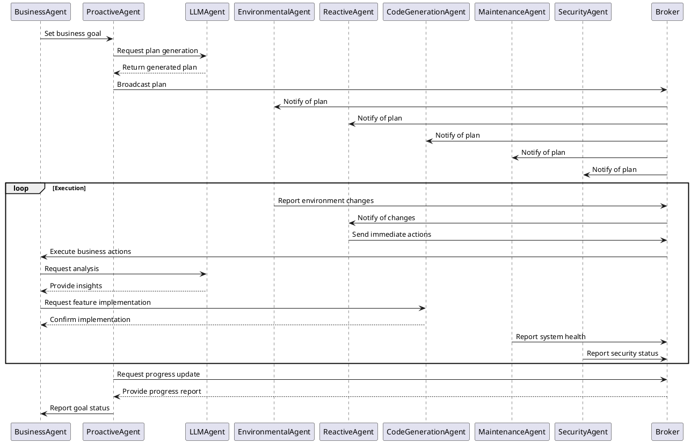

# Core Agents in MABOS (Multiagent Business Operating System)

This directory contains the implementation of core agents that form the backbone of the MABOS system. These agents work together to manage various aspects of business operations, decision-making, and system maintenance.

## Overview of Core Agents

1. **ProactiveAgent**: A goal-oriented agent that actively pursues objectives, plans actions, and executes them.
2. **ReactiveAgent**: Responds to stimuli based on predefined rules, allowing for quick reactions to environmental changes.
3. **EnvironmentalAgent**: Interacts with and perceives the environment, updating its beliefs based on sensory input.
4. **BusinessAgent**: Specializes in business-related tasks, focusing on profit increase and market expansion.
5. **LLMAgent**: Leverages Large Language Models for advanced reasoning and natural language processing tasks.
6. **CodeGenerationAgent**: Responsible for generating code based on designs and models for the domain-specific MAS.
7. **MaintenanceAgent**: Performs system maintenance tasks, ensuring optimal performance and data integrity.
8. **SecurityAgent**: Manages security aspects, including secure communication and threat prevention.
9. **BusinessPlanAgent**: Develops comprehensive business plans using predefined templates.
10. **Broker**: Facilitates communication between agents, acting as a message router.

## Agent Interactions and Goal Accomplishment

These agents interact with each other through a combination of direct communication, shared knowledge bases, and coordinated actions. Here's how they work together to accomplish goals:

1. **Goal Identification**: The BusinessAgent or BusinessPlanAgent typically initiates high-level business goals based on market analysis and financial data.

2. **Planning**: The ProactiveAgent, in collaboration with the LLMAgent, develops detailed plans to achieve these goals. The CodeGenerationAgent may be involved if new functionalities need to be implemented.

3. **Environmental Awareness**: The EnvironmentalAgent continuously monitors the business environment, updating the shared knowledge base with new information.

4. **Reactive Responses**: The ReactiveAgent handles immediate responses to environmental changes or unexpected events, ensuring quick adaptability.

5. **Execution**: As plans are executed, various agents play their roles:
   - The BusinessAgent focuses on financial and market-related actions.
   - The LLMAgent assists with natural language processing tasks and advanced reasoning.
   - The CodeGenerationAgent implements new features or optimizes existing ones.
   - The MaintenanceAgent ensures system health during operations.

6. **Security**: Throughout all operations, the SecurityAgent monitors communications and enforces security policies to protect the system and its data.

7. **Communication**: The Broker facilitates inter-agent communication, ensuring messages are routed correctly and efficiently.

8. **Continuous Improvement**: Agents like the MaintenanceAgent and OptimizationAgent (if implemented) continuously work to improve system performance and efficiency.

## Activity Diagram

The following activity diagram illustrates the high-level workflow of the MABOS system:

