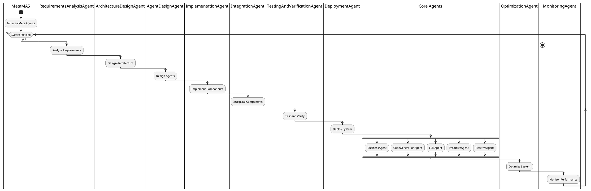
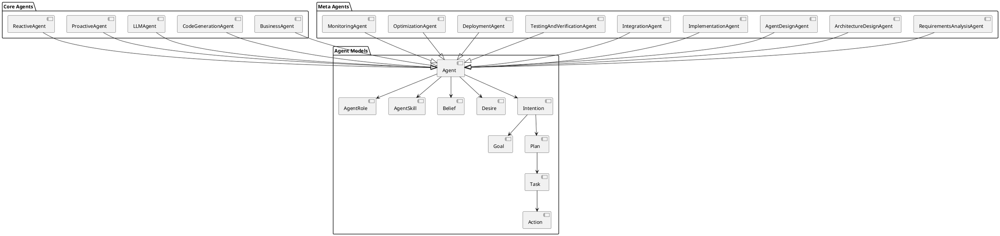
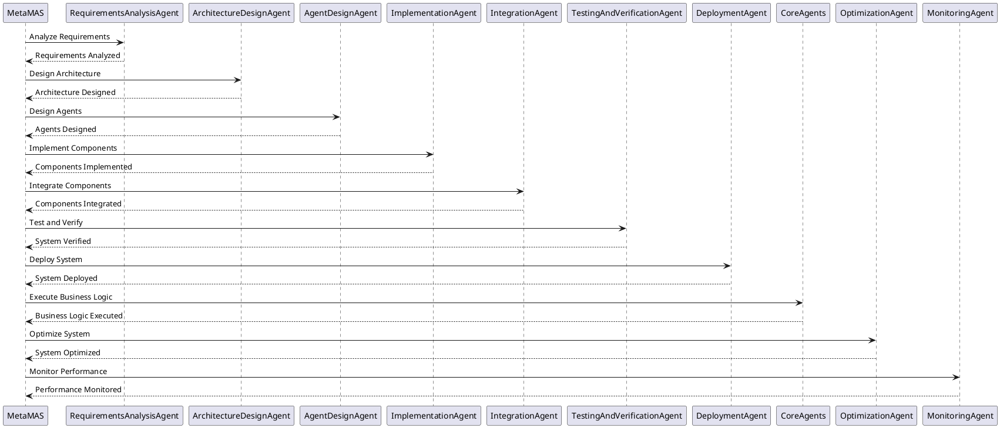

# MABOS Agents

1. action.py:
This file likely defines the Action class, which represents actions that agents can perform. Actions are fundamental to the BDI (Belief-Desire-Intention) architecture. They are the concrete steps agents take to achieve their goals.

Relevance: Actions are crucial for all agents in the MAS, as they define what agents can do to affect their environment and achieve their goals.

Interactions: All agents will use actions defined in this file.

2. agent_role.py:
This file defines the AgentRole class, which represents different roles that agents can take on within the MAS.

Relevance: Roles allow for specialization and division of labor within the MAS, enabling agents to focus on specific tasks or responsibilities.

Interactions: The SecurityAgent and MaintenanceAgent explicitly use AgentRole. Other agents likely use roles as well to define their responsibilities within the system.

3. agent_skill.py:
This file defines various skills that agents can possess, such as CommunicationSkill, ExecutionSkill, LearningSkill, PerceptionSkill, and PlanningSkill.

Relevance: Skills provide agents with specific capabilities, allowing them to perform specialized tasks within the MAS.

Interactions: The BusinessPlanAgent explicitly uses these skills. Other agents likely incorporate these skills to enhance their capabilities.

4. belief.py:
This file defines the Belief class, which represents an agent's beliefs about the world.

Relevance: Beliefs are a core component of the BDI architecture, representing an agent's understanding of its environment.

Interactions: All agents in the MAS use beliefs to make decisions and plan actions.

5. agent.py:
This file defines the base Agent class, which serves as the foundation for all agents in the system.


```21:109:app/core/models/agent/agent.py
class Agent(BaseModel):
    def __init__(self):
        self.rule_engine: 'RuleEngine' = None
        
    def initialize_rule_engine(self):
        from app.models.rules.rules_engine import RuleEngine
        self.rule_engine = RuleEngine()
    
    model_config = ConfigDict(arbitrary_types_allowed=True)
    
    agent_id: str = Field(..., description="The unique identifier of the agent")
    name: str = Field(..., description="The name of the agent")
    beliefs: List['Belief'] = Field(default_factory=list, description="The agent's current beliefs about the world")
    desires: List['Desire'] = Field(default_factory=list, description="The agent's current desires")
    intentions: List['Intention'] = Field(default_factory=list, description="The agent's current intentions")
    available_actions: List['Action'] = Field(default_factory=list, description="Actions available to the agent")
    roles: List['AgentRole'] = Field(default_factory=list, description="Roles assigned to the agent")

    @field_validator('agent_type', check_fields=False)
    def validate_agent_type(cls, value):
        allowed_types = ['reactive', 'deliberative', 'hybrid']
        if value not in allowed_types:
            raise ValueError(f'Agent type must be one of {allowed_types}')
        return value
    def act(self):
        for intention in self.intentions:
            if intention.goal.description == 'process_orders':
                for order_id in self.beliefs.get('pending_orders', []):
                    self.post_fact({'subject': 'order', 'action': 'process', 'order_id': order_id})

    def add_belief(self, belief: 'Belief'):
        self.beliefs.append(belief)

    def remove_belief(self, belief: 'Belief'):
        self.beliefs.remove(belief)

    def add_desire(self, desire: 'Desire'):
        self.desires.append(desire)

    def remove_desire(self, desire: 'Desire'):
        self.desires.remove(desire)

    def add_intention(self, intention: 'Intention'):
        self.intentions.append(intention)

    def remove_intention(self, intention: 'Intention'):
        self.intentions.remove(intention)

    def add_action(self, action: 'Action'):
        self.available_actions.append(action)

    def remove_action(self, action: 'Action'):
        self.available_actions.remove(action)

    def deliberate(self):
        active_desires = [d for d in self.desires if d.status == "active"]
        active_desires.sort(key=lambda d: d.priority, reverse=True)

        if active_desires and (selected_desire := active_desires[0]):
            if all(i.goal != selected_desire for i in self.intentions):
                self.add_intention(Intention(goal=selected_desire))
    def plan(self):
        for intention in self.intentions:
            if intention.status == "active":
                if applicable_actions := [
                    action for action in self.available_actions 
                    if action.is_applicable(lambda key: next((b.certainty for b in self.beliefs if b.description == key), None))
                ]:
                    selected_action = applicable_actions[0]
                    if selected_action.is_completed(lambda key: next((b.certainty for b in self.beliefs if b.description == key), None)):
                        intention.complete_intention()
                    else:
                        intention.actions.append(selected_action)
                else:
                    intention.suspend_intention()

    def execute(self):
        for intention in self.intentions:
            for action in intention.actions:
                action.execute(
                    get_belief=lambda key: next((b.certainty for b in self.beliefs if b.description == key), None),
                    set_belief=lambda key, value: self.add_belief(Belief(description=key, certainty=value))
                )

    def perceive(self, observations):
        self.current_state = observations
        self.update_beliefs(self.current_state)
```


Relevance: The Agent class is crucial as it provides the basic structure and functionality for all agents in the MAS.

Interactions: All other agent types inherit from or use this base Agent class.

6. desire.py:
This file defines the Desire class, representing an agent's desires or goals.

Relevance: Desires are a core component of the BDI architecture, representing what an agent wants to achieve.

Interactions: All agents in the MAS use desires to guide their decision-making and planning processes.

7. goal.py:
This file defines the Goal class, which represents specific objectives that agents aim to achieve.


```1:140:app/core/models/agent/goal.py
from typing import Dict, List, Optional

from pydantic import BaseModel, ConfigDict, Field


class SoftGoal(BaseModel):
    id: str
    description: str
    contribution: str  # e.g., "positive", "negative"

class Goal(BaseModel):
    """
    Represents a goal in the multi-agent business operating system.

    Attributes:
        id (str): The unique identifier of the goal.
        description (str): A description of the goal.
        priority (int): The priority level of the goal.
        status (str): The current status of the goal.
        subgoals (List[str]): A list of subgoals associated with the goal.
        llm_generated_context (Optional[str]): Additional context generated by the language model.
        is_achieved (bool): Indicates whether the goal has been achieved.
        metadata (Dict[str, any]): Additional metadata associated with the goal.
        parent_goal (Optional['Goal']): The parent goal of the current goal.
        child_goals (List['Goal']): A list of child goals associated with the current goal.
        soft_goals (List[SoftGoal]): A list of soft goals associated with the goal.
        contributions (Dict[str, float]): Contributions to parent goals.
    """
    model_config = ConfigDict(arbitrary_types_allowed=True)
    
    id: str = Field(..., description="The unique identifier of the goal")
    description: str = Field(..., description="A description of the goal")
    priority: int = Field(..., description="The priority level of the goal")
    status: str = Field(..., description="The current status of the goal")
    subgoals: List[str] = Field(default_factory=list, description="A list of subgoals associated with the goal")
    llm_generated_context: Optional[str] = Field(default=None, description="Additional context generated by the language model")
    is_achieved: bool = Field(default=False, description="Indicates whether the goal has been achieved")
    metadata: Dict[str, any] = Field(default_factory=dict, description="Additional metadata associated with the goal")
    parent_goal: Optional['Goal'] = Field(default=None, description="The parent goal of the current goal")
    child_goals: List['Goal'] = Field(default_factory=list, description="A list of child goals associated with the current goal")
    soft_goals: List[SoftGoal] = Field(default_factory=list, description="A list of soft goals associated with the goal")
    contributions: Dict[str, float] = Field(default_factory=dict, description="Contributions to parent goals")

    def decompose(self, llm_decomposer, sub_goals: List['Goal']):
        """
        Decomposes the goal into subgoals using the provided language model decomposer.

        Args:
            llm_decomposer: The language model decomposer used to decompose the goal.
            sub_goals (List['Goal']): A list of subgoals to be added as child goals.
        """
        self.subgoals = llm_decomposer.decompose(self)
        self.child_goals.extend(sub_goals)
        self.validate_subgoals()
        for sub_goal in sub_goals:
            sub_goal.parent_goal = self

    def validate_subgoals(self):
        """
        Validates the subgoals associated with the goal.

        Raises:
            TypeError: If the subgoals are not a list or if any subgoal is not a string.
            ValueError: If any subgoal is empty or whitespace, or if there are no subgoals.
        """
        if not isinstance(self.subgoals, list):
            raise TypeError("Subgoals must be a list")
        
        for subgoal in self.subgoals:
            if not isinstance(subgoal, str):
                raise TypeError("Each subgoal must be a string")
            
            if len(subgoal.strip()) == 0:
                raise ValueError("Subgoals cannot be empty or whitespace")
        
        if len(self.subgoals) == 0:
            raise ValueError("Goal must have at least one subgoal")

    def update_status(self, is_achieved: bool):
        """
        Updates the achievement status of the goal.

        Args:
            is_achieved (bool): Indicates whether the goal has been achieved.
        """
        self.is_achieved = is_achieved

    def add_metadata(self, key: str, value: any):
        """
        Adds metadata to the goal.

        Args:
            key (str): The key of the metadata.
            value (any): The value of the metadata.
        """
        self.metadata[key] = value
        
    def add_soft_goal(self, soft_goal: SoftGoal):
        self.soft_goals.append(soft_goal)

    def update_contribution(self, parent_goal_id: str, contribution: float):
        self.contributions[parent_goal_id] = contribution

    def propagate_changes(self):
        for child_goal in self.child_goals:
            child_goal.update_contribution(self.id, self.contributions.get(child_goal.id, 0))
            child_goal.propagate_changes()

```


Relevance: Goals are crucial for agents to have clear objectives and measure their progress.

Interactions: All agents in the MAS use goals to guide their actions and planning.

8. intention.py:
This file defines the Intention class, representing an agent's commitment to achieving a specific goal.


```1:101:app/core/models/agent/intention.py
from typing import Any, List, Optional

from pydantic import BaseModel

from .belief import Belief
from .goal import Goal
from .plan import Plan


class Intention(BaseModel):
    """
    Represents an intention in the BDI model.

    Attributes:
        status (str): The current status of the intention.
        goal (Goal): The goal associated with the intention.
        plan (Plan): The plan to achieve the goal.
    """
    id: str
    status: str = "pending"
    goal: Goal
    plan: Plan
    
    class Config:
        from_attributes = True

    def activate_intention(self):
        """
        Activates the intention by setting its status to "active".
        """
        self.status = "active"

    def suspend_intention(self):
        """
        Suspends the intention by setting its status to "suspended".
        """
        self.status = "suspended"

    def complete_intention(self):
        """
        Completes the intention by setting its status to "completed".
        """
        self.status = "completed"

    def is_achievable(self, current_beliefs: List[Belief]) -> bool:
        """
        Checks if the intention is achievable based on the current beliefs.

        Args:
            current_beliefs (List[Belief]): The list of current beliefs.

        Returns:
            bool: True if the intention is achievable, False otherwise.
        """
        return any(belief.description == self.goal.description and belief.certainty >= 0.8 for belief in current_beliefs)

    def execute_intention(self, execute_action):
        """
        Executes the intention by calling the provided execute_action function.

        Args:
            execute_action: The function to execute the intention.
        """
        result = execute_action()
        self.status = "completed" if result else "failed"
        return result

    def update_status(self, new_status: str):
        """
        Updates the status of the intention.

        Args:
            new_status (str): The new status of the intention.
        """
        self.status = new_status

    def revise_intention(self, new_goal: Goal, new_plan: Optional[Plan] = None):
        """
        Revises the intention by updating the goal and optionally the plan, and setting the status to "revised".

        Args:
            new_goal (Goal): The new goal for the intention.
            new_plan (Optional[Plan]): The new plan for the intention, if provided.
        """
        self.goal = new_goal
        if new_plan:
            self.plan = new_plan
        self.status = "revised"

    def is_completed(self) -> bool:
        """
        Checks if the intention is completed.

        Returns:
            bool: True if the intention status is "completed", False otherwise.
        """
        return self.status == "completed"

    def is_failed(self) -> bool:
        """
        Checks if the intention has failed.
```


Relevance: Intentions are a core component of the BDI architecture, representing an agent's commitment to a course of action.

Interactions: All agents in the MAS use intentions to guide their behavior and decision-making.

9. plan.py:
This file defines the Plan and PlanStep classes, representing the steps an agent will take to achieve a goal.


```1:72:app/core/models/agent/plan.py
from typing import Dict, List, Optional

from pydantic import BaseModel, ConfigDict


class PlanStep(BaseModel):
    """
    Represents a step in a plan.

    Attributes:
        id (str): The unique identifier of the plan step.
        description (str): The description of the plan step.
        is_completed (bool): Indicates whether the plan step is completed. Defaults to False.
        goal_id (Optional[str]): The identifier of the associated goal, if any. Defaults to None.
    """
    model_config = ConfigDict(arbitrary_types_allowed=True)
    
    id: str
    description: str
    is_completed: bool = False
    goal_id: Optional[str] = None

class Plan(BaseModel):
    """
    Represents a plan for achieving a goal.

    Attributes:
        id (str): The unique identifier of the plan.
        goal_id (str): The identifier of the associated goal.
        steps (List[PlanStep]): The list of steps in the plan.
        symbolic_plan (Dict): The symbolic representation of the plan.
        llm_plan (Dict): The LLM (Language Model) representation of the plan.
        is_completed (bool): Indicates whether the plan is completed. Defaults to False.
    """
    model_config = ConfigDict(arbitrary_types_allowed=True)
    id: str
    goal_id: str
    steps: List[PlanStep]
    symbolic_plan: Dict
    llm_plan: Dict
    is_completed: bool = False

    def add_step(self, step: PlanStep):
        """
        Adds a step to the plan and links it to the associated goal if specified.

        Args:
            step (PlanStep): The plan step to add.
        """
        self.steps.append(step)
        if step.goal_id:
            self._link_step_to_goal(step)
            
    def _link_step_to_goal(self, step: PlanStep):
        """
        Links a plan step to its associated goal.

        Args:
            step (PlanStep): The plan step to link.

        Raises:
            ValueError: If the specified goal is not found.
        """
        from app.models.goal import Goal
        
        if step.goal_id:
            goal = Goal.get(id=step.goal_id)
            if goal:
                goal.plan_steps.append(step)
                goal.save()
            else:
                raise ValueError(f"Goal with ID {step.goal_id} not found")
```


Relevance: Plans are crucial for agents to organize their actions and achieve their goals efficiently.

Interactions: All agents in the MAS use plans to structure their approach to achieving goals.

10. task.py:
This file defines the Task and TaskOutput classes, representing individual tasks that agents can perform.


```1:51:app/core/models/agent/task.py
import uuid
from datetime import datetime
from typing import Any, Dict, List, Optional

from pydantic import UUID4, BaseModel, Field


class TaskOutput(BaseModel):
    description: str = Field(description="Description of the task")
    summary: Optional[str] = Field(description="Summary of the task", default=None)
    exported_output: Any = Field(description="Output of the task", default=None)
    raw_output: str = Field(description="Result of the task")

    def result(self):
        return self.exported_output

class Task(BaseModel):
    id: UUID4 = Field(default_factory=uuid.uuid4, description="Unique identifier for the task")
    description: str = Field(description="Description of the actual task")
    expected_output: str = Field(description="Clear definition of expected output for the task")
    action_id: str = Field(description="ID of the action associated with this task")
    context: Optional[List[UUID4]] = Field(description="IDs of other tasks that will have their output used as context for this task", default=None)
    config: Optional[Dict[str, Any]] = Field(description="Configuration for the task", default=None)
    status: str = Field(default="pending", description="Current status of the task")
    output: Optional[TaskOutput] = Field(description="Task output, its final result after being executed", default=None)
    deadline: Optional[datetime] = Field(description="Deadline for the task", default=None)
    priority: int = Field(default=0, description="Priority of the task")
    dependencies: List[UUID4] = Field(default_factory=list, description="List of task IDs that this task depends on")

    def execute(self, execute_action) -> Optional[str]:
        self.status = "in_progress"
        if result := execute_action(self.action_id):
            self.status = "completed"
            self.output = TaskOutput(
                description=self.description,
                exported_output=result,
                raw_output=str(result)
            )
            return result
        else:
            self.status = "failed"
            return None

    def is_completed(self) -> bool:
        return self.status == "completed"

    def is_deadline_reached(self) -> bool:
        return self.deadline and datetime.now() > self.deadline

    def update_status(self, new_status: str):
        self.status = new_status
```


Relevance: Tasks provide a granular level of action for agents, allowing them to break down complex goals into manageable steps.

Interactions: All agents in the MAS use tasks to structure their work and achieve their goals.

11. onboarding_agent.py:
This file likely defines the OnboardingAgent, responsible for integrating new agents or users into the MAS.

Relevance: The OnboardingAgent is crucial for smoothly introducing new components or users to the system.

Interactions: Interacts with new agents or users, as well as the MetaMAS to coordinate the onboarding process.

12. database_agent.py:
This file likely defines the DatabaseAgent, responsible for managing data storage and retrieval within the MAS.

Relevance: The DatabaseAgent is crucial for maintaining and accessing shared knowledge within the system.

Interactions: Interacts with all agents that need to store or retrieve data, particularly the BusinessAgent and EnvironmentalAgent.

13. deployment_agent.py:
This file defines the DeploymentAgent, responsible for deploying the MAS components.

Relevance: The DeploymentAgent is crucial for setting up and maintaining the MAS infrastructure.

Interactions: Interacts with the ImplementationAgent, IntegrationAgent, and MetaMAS to coordinate deployment activities.

14. domain_modeling_agent.py:
This file likely defines the DomainModelingAgent, responsible for creating and maintaining models of the business domain.

Relevance: The DomainModelingAgent is crucial for ensuring that the MAS accurately represents the business domain it operates in.

Interactions: Interacts with the RequirementsAnalysisAgent, ArchitectureDesignAgent, and OntologyEngineeringAgent to create comprehensive domain models.

15. architecture_design_agent.py:
This file defines the ArchitectureDesignAgent, responsible for designing the overall MAS architecture.


```1:39:app/core/agents/meta_agents/architecture_design_agent.py
from typing import Any, Dict, List

from meta_agents import MetaAgent
...
class ArchitectureDesignAgent(MetaAgent):
    """
    Designs the overall architecture of the domain-specific MAS.
    
    Key functions:
    - Define the high-level structure of the MAS
    - Determine communication protocols and interaction patterns
    - Design data flow and storage mechanisms
    - Ensure alignment with TOGAF enterprise architecture principles
    """
    def process(self, input_data: Dict[str, Any]) -> Dict[str, Any]:
        """
        Design the overall architecture of the domain-specific MAS based on input data.

        Args:
            input_data (Dict[str, Any]): The input data required for designing the MAS architecture.

        Returns:
            Dict[str, Any]: A dictionary containing the designed MAS architecture components.
        """
        mas_structure = self._define_mas_structure(input_data)
        communication_protocols = self._determine_communication_protocols(mas_structure)
        interaction_patterns = self._determine_interaction_patterns(mas_structure)
        data_flow_design = self._design_data_flow(mas_structure)
        storage_mechanisms = self._design_storage_mechanisms(data_flow_design)
        self._ensure_togaf_alignment(mas_structure, communication_protocols, interaction_patterns, data_flow_design, storage_mechanisms)
        
        return {
            "mas_structure": mas_structure,
            "communication_protocols": communication_protocols,
            "interaction_patterns": interaction_patterns,
            "data_flow_design": data_flow_design,
            "storage_mechanisms": storage_mechanisms
        }
```


Relevance: The ArchitectureDesignAgent is crucial for creating a robust and efficient MAS structure.

Interactions: Interacts with the RequirementsAnalysisAgent, DomainModelingAgent, and ImplementationAgent to design and refine the MAS architecture.

16. implementation_agent.py:
This file defines the ImplementationAgent, responsible for implementing the designed MAS components.


```6:104:app/core/agents/meta_agents/implementation_agent.py
class ImplementationAgent(MetaAgent):
    def __init__(self, name: str):
        super().__init__(name=name, agent_type="implementation")
        self.add_belief("Proper implementation is crucial for MAS success")
        self.add_desire("Implement a fully functional MAS", priority=10)
        self.add_goal("Implement domain-specific MAS", priority=9)
        self.create_plan(
            self.goals[0].id,
            [
                "Set up development environment",
                "Implement agent infrastructure",
                "Implement individual agents",
                "Implement communication protocols",
                "Integrate components",
                "Perform unit testing",
                "Conduct integration testing"
            ]
        )

    def reason(self):
        if any(belief.description == "New implementation requirement received" for belief in self.beliefs):
            self.add_goal("Update implementation with new requirement", priority=8)
        
        if any(belief.description == "Implementation bug detected" for belief in self.beliefs):
            self.add_goal("Fix implementation bug", priority=10)

    def plan(self):
        for goal in self.goals:
            if goal.description == "Update implementation with new requirement":
                self.create_plan(
                    goal.id,
                    [
                        "Analyze new requirement",
                        "Identify affected components",
                        "Implement changes",
                        "Update unit tests",
                        "Perform integration testing"
                    ]
                )
            elif goal.description == "Fix implementation bug":
                self.create_plan(
                    goal.id,
                    [
                        "Reproduce bug",
                        "Identify root cause",
                        "Implement fix",
                        "Update tests",
                        "Verify fix"
                    ]
                )
    def execute(self):
        for plan in self.plans:
            for task in plan.steps:
                if task.status == "pending":
                    print(f"Executing task: {task.description}")
                    self.execute_task(task)
                    self.update_task_status(task.id, "completed")

    def execute_task(self, task: Task):
        if task.description == "Set up development environment":
            self.setup_development_environment()
        elif task.description == "Implement agent infrastructure":
            self.implement_agent_infrastructure()
        elif task.description == "Implement individual agents":
            self.implement_individual_agents()
        elif task.description == "Implement communication protocols":
            self.implement_communication_protocols()
        elif task.description == "Integrate components":
            self.integrate_components()
        elif task.description == "Perform unit testing":
            self.perform_unit_testing()
        elif task.description == "Conduct integration testing":
            self.conduct_integration_testing()
        else:
            print(f"Executing generic task: {task.description}")
    def implement_mas(self, infrastructure_design: Dict[str, Any], agent_implementations: Dict[str, Any], communication_infrastructure_design: Dict[str, Any], communication_protocols: Dict[str, Any]) -> Dict[str, Any]:
        implementation_result = {
            "status": "in_progress",
            "components": {}
        }

        # Implement agent infrastructure
        implementation_result["components"]["agent_infrastructure"] = self.implement_agent_infrastructure(infrastructure_design)

        # Implement individual agents
        implementation_result["components"]["agents"] = self.implement_individual_agents(agent_implementations)

        # Implement communication infrastructure
        implementation_result["components"]["communication_infrastructure"] = self.implement_communication_infrastructure(communication_infrastructure_design)

        # Implement communication protocols
        implementation_result["components"]["communication_protocols"] = self.implement_communication_protocols(communication_protocols)

        # Integrate all components
        implementation_result["status"] = "completed" if self.integrate_components(implementation_result["components"]) else "failed"

        return implementation_result
```


Relevance: The ImplementationAgent is crucial for turning designs and specifications into functional MAS components.

Interactions: Interacts with the ArchitectureDesignAgent, CodeGenerationAgent, and IntegrationAgent to implement and integrate MAS components.

17. integration_agent.py:
This file defines the IntegrationAgent, responsible for integrating various MAS components.

Relevance: The IntegrationAgent is crucial for ensuring that all parts of the MAS work together seamlessly.

Interactions: Interacts with the ImplementationAgent, DeploymentAgent, and TestingAndVerificationAgent to integrate and validate MAS components.

18. meta_agents.py:
This file likely defines the base MetaAgent class, which serves as a foundation for agents that manage the MAS itself.

Relevance: MetaAgents are crucial for overseeing and managing the overall MAS structure and behavior.

Interactions: Interacts with all other meta agents and coordinates high-level MAS operations.

19. meta_mas.py:
This file defines the MetaMAS class, which orchestrates the overall MAS operation.


```10:44:app/core/agents/meta_agents/meta_mas.py
class MetaMAS:
    def __init__(self):
        self.agents: List[MetaAgent] = [
            RequirementsAnalysisAgent("ReqAnalyzer"),
            DomainModelingAgent("DomainModeler"),
            ArchitectureDesignAgent("ArchDesigner"),
            ImplementationAgent("Implementer"),
            TestingAndVerificationAgent("Tester"),
            DeploymentAgent("Deployer"),
            IntegrationAgent("Integrator"),
            MonitoringAgent("Monitor"),
            OptimizationAgent("Optimizer")
        ]

    def run_meta_mas(self):
        while not self.goal_achieved():
            for agent in self.agents:
                agent.reason()
                agent.plan()
                agent.execute()
            self.facilitate_communication()
            self.update_global_state()

    def goal_achieved(self) -> bool:
        # Check if all agents have completed their goals
        return all(all(goal.is_achieved for goal in agent.goals) for agent in self.agents)

    def facilitate_communication(self):
        # Implement inter-agent communication logic
        for agent in self.agents:
            for belief in agent.beliefs:
                # Share relevant beliefs with other agents
                for other_agent in self.agents:
                    if other_agent != agent:
                        other_agent.add_belief(belief.description, belief.certainty)
```


Relevance: The MetaMAS is crucial for coordinating all meta agents and ensuring the smooth operation of the entire MAS.

Interactions: Interacts with all meta agents to manage the MAS lifecycle and coordinate system-wide activities.

20. monitoring_agent.py:
This file likely defines the MonitoringAgent, responsible for monitoring the performance and health of the MAS.

Relevance: The MonitoringAgent is crucial for ensuring the MAS operates efficiently and identifying potential issues.

Interactions: Interacts with all agents to collect performance data and with the OptimizationAgent to trigger optimizations when needed.

21. ontology_engineering_agent.py:
This file likely defines the OntologyEngineeringAgent, responsible for creating and maintaining ontologies used in the MAS.

Relevance: The OntologyEngineeringAgent is crucial for ensuring consistent knowledge representation across the MAS.

Interactions: Interacts with the DomainModelingAgent and RequirementsAnalysisAgent to create and refine ontologies.

22. operational_meta_agent.py:
This file likely defines the OperationalMetaAgent, responsible for managing day-to-day operations of the MAS.

Relevance: The OperationalMetaAgent is crucial for ensuring smooth daily functioning of the MAS.

Interactions: Interacts with core agents and other meta agents to coordinate operational activities.

23. optimization_agent.py:
This file likely defines the OptimizationAgent, responsible for improving the performance and efficiency of the MAS.

Relevance: The OptimizationAgent is crucial for continuously enhancing the MAS's performance.

Interactions: Interacts with the MonitoringAgent to identify optimization opportunities and with other agents to implement improvements.

24. requirements_analysis_agent.py:
This file likely defines the RequirementsAnalysisAgent, responsible for analyzing and managing system requirements.

Relevance: The RequirementsAnalysisAgent is crucial for ensuring the MAS meets its intended purposes and stakeholder needs.

Interactions: Interacts with the DomainModelingAgent, ArchitectureDesignAgent, and BusinessAgent to gather and analyze requirements.

25. strategic_meta_agent.py:
This file likely defines the StrategicMetaAgent, responsible for high-level strategic planning for the MAS.

Relevance: The StrategicMetaAgent is crucial for setting long-term goals and directions for the MAS.

Interactions: Interacts with the TacticalMetaAgent and OperationalMetaAgent to align strategies across different levels of the MAS.

26. testing_and_verification_agent.py:
This file likely defines the TestingAndVerificationAgent, responsible for testing and verifying MAS components and behaviors.

Relevance: The TestingAndVerificationAgent is crucial for ensuring the reliability and correctness of the MAS.

Interactions: Interacts with the ImplementationAgent, IntegrationAgent, and DeploymentAgent to validate MAS components and behaviors.

27. tactical_meta_agent.py:
This file likely defines the TacticalMetaAgent, responsible for medium-term planning and resource allocation within the MAS.

Relevance: The TacticalMetaAgent is crucial for translating strategic goals into actionable plans.

Interactions: Interacts with the StrategicMetaAgent and OperationalMetaAgent to coordinate planning across different time horizons.

28. proactive_agent.py:
This file likely defines the ProactiveAgent, capable of taking initiative and pursuing goals independently.

Relevance: ProactiveAgents are crucial for autonomous decision-making and goal-driven behavior within the MAS.

Interactions: Interacts with other core agents and meta agents to pursue goals and contribute to the overall MAS objectives.

29. reactive_agent.py:
This file defines the ReactiveAgent, which responds to stimuli based on predefined rules.


```1:64:app/core/agents/core_agents/reactive_agent.py
from typing import Any, Dict, List
from uuid import UUID

from pydantic import BaseModel, Field
...
class ReactiveAgent(BaseModel):
    """
    A reactive agent that responds to stimuli based on predefined rules.

    Attributes:
        stimulus_response_rules (List[Dict[str, Any]]): List of stimulus-response rules.
    """
    id: UUID
    name: str
    
    class Config:
        from_attributes = True  # Allows model creation from ORM objects
        
    def __init__(self):
        # Import Agent within the constructor or methods as needed
        from app.models.agent.agent import Agent
        self.base = Agent()
    # Rest of the class remains unchanged
    stimulus_response_rules: List[Dict[str, Any]] = Field(default_factory=list, description="List of stimulus-response rules")

    def add_rule(self, stimulus: str, response: str):
        """
        Add a new stimulus-response rule.

        Args:
            stimulus (str): The stimulus that triggers the rule.
            response (str): The response action to be executed.
        """
        self.stimulus_response_rules.append({"stimulus": stimulus, "response": response})

    def perceive(self):
        """
        Perceive the environment and react based on stimulus-response rules.
        """
        for belief in self.beliefs:
            for rule in self.stimulus_response_rules:
                if rule["stimulus"] in belief.description:
                    if self.can_execute_action(rule["response"]):
                        self.execute_action(rule["response"])
                        break  # Stop after executing the highest priority matching rule
                    else:
                        print(f"Cannot execute action: {rule['response']}. Insufficient resources.")
    def can_execute_action(self, action: str) -> bool:
        """
        Check if the agent has the necessary resources to execute the action.

        Args:
            action (str): The action to be executed.

        Returns:
            bool: True if the agent has sufficient resources, False otherwise.
        """
        # Check if the agent has the necessary resources to execute the action
        action_requirements = self.get_action_requirements(action)

        # Simplified check for resource sufficiency
        return all(self.resources.get(resource, 0) >= required_amount for resource, required_amount in action_requirements.items())
```


Relevance: ReactiveAgents are crucial for handling immediate responses to environmental changes within the MAS.

Interactions: Interacts with the EnvironmentalAgent and other core agents to respond to system events and changes.

30. broker.py:
This file defines the Broker class, which manages agent communication and message routing.


```1:79:app/core/agents/core_agents/broker.py
import logging
from typing import Any, Dict

logger = logging.getLogger(__name__)

class Broker:
    """
    A message broker that facilitates communication between agents.

    This broker keeps track of registered agents and their locations,
    and routes messages between them.

    Attributes:
        agents (Dict[str, str]): A dictionary mapping agent names to their locations.
    """

    def __init__(self):
        self.agents: Dict[str, str] = {}

    def register_agent(self, agent_name: str, location: str) -> None:
        """
        Registers an agent with the broker.

        Args:
            agent_name (str): The name of the agent.
            location (str): The location of the agent.
        """
        self.agents[agent_name] = location
        logger.info(f"Agent {agent_name} registered at location {location}")

    def unregister_agent(self, agent_name: str) -> None:
        """
        Unregisters an agent from the broker.

        Args:
            agent_name (str): The name of the agent to unregister.
        """
        if agent_name in self.agents:
            del self.agents[agent_name]
            logger.info(f"Agent {agent_name} unregistered")
        else:
            logger.warning(f"Attempted to unregister non-existent agent {agent_name}")

    def route_message(self, sender: Any, recipient: str, message: str) -> bool:
        """
        Routes a message from the sender to the recipient.

        Args:
            sender (Any): The sending agent.
            recipient (str): The name of the recipient agent.
            message (str): The message to be sent.

        Returns:
            bool: True if the message was successfully routed, False otherwise.
        """
        if recipient in self.agents:
            recipient_location = self.agents[recipient]
            logger.info(f"Routing message from {sender} to {recipient} at {recipient_location}")
            # In a real implementation, this would actually send the message
            # For now, we'll just log it
            logger.info(f"Message content: {message}")
            return True
        else:
            logger.warning(f"Recipient {recipient} not found")
            return False

    def get_agent_location(self, agent_name: str) -> str:
        """
        Gets the location of a registered agent.

        Args:
            agent_name (str): The name of the agent.

        Returns:
            str: The location of the agent, or None if the agent is not registered.
        """
        return self.agents.get(agent_name)

    def list_agents(self) -> Dict[str, str]:
```


Relevance: The Broker is crucial for facilitating communication between agents in the MAS.

Interactions: Interacts with all agents in the MAS to route messages and manage agent locations.

31. business_agent.py:
This file defines the BusinessAgent, which handles business-specific logic and decision-making.


```1:35:app/core/agents/core_agents/business_agent.py
from typing import Any, Dict, List

from core.models.agent.agent import Agent
from core.models.agent.belief import Belief
from core.models.agent.desire import Desire
from core.models.agent.intention import Intention
from core.models.knowledge.reasoning.reasoning_engine import ReasoningEngine
from pydantic import Field


class BusinessAgent(Agent):
    business_id: str = Field(..., description="The business ID associated with the agent")
    any_field: Any = Field(..., description="A field that can be of any type")
    beliefs: Dict[str, Belief] = Field(default_factory=dict, description="The agent's current beliefs")
    desires: List[Desire] = Field(default_factory=list, description="The agent's current desires")
    intentions: List[Intention] = Field(default_factory=list, description="The agent's current intentions")
    reasoning_engine: ReasoningEngine = Field(default_factory=ReasoningEngine, description="The agent's reasoning engine")

    def update_belief(self, key: str, value: Any):
        self.beliefs[key] = Belief(description=key, certainty=1.0, value=value)

    def add_desire(self, desire: Desire):
        self.desires.append(desire)

    def set_intention(self, intention: Intention):
        self.intentions.append(intention)

    def act(self):
        # This method will be called by the rules engine
        pass

    def formulate_problem(self, problem_type, data):
        # Implement problem formulation logic
        pass
    
```


Relevance: The BusinessAgent is crucial for executing business-specific tasks and making business-related decisions within the MAS.

Interactions: Interacts with the BusinessPlanAgent, EnvironmentalAgent, and various meta agents to execute business processes.

32. business_plan_agent.py:
This file defines the BusinessPlanAgent, responsible for developing and managing business plans.


```1:51:app/core/agents/core_agents/business_plan_agent.py
# mabos/agents/business_plan_agent.py
from pydantic import BaseModel

from app.agents.core_agents.broker import Broker
from app.models.communication import AgentCommunication
from app.models.knowledge.knowledge_base import KnowledgeBase
from app.models.knowledge.knowledge_graph import KnowledgeGraph
from app.tools.reasoning_engine import Reasoning
from app.models.skills import (CommunicationSkill, ExecutionSkill,
                                    LearningSkill, PerceptionSkill,
                                    PlanningSkill)


class BusinessPlanTemplate(BaseModel):
    executive_summary: str
    company_description: str
    market_analysis: dict
    organization_management: str
    service_product_line: str
    marketing_sales: str
    funding_request: str
    financial_projections: dict
    appendix: str
class BusinessPlanAgent:
    def __init__(self, location):
        self.location = location
        self.knowledge_base = KnowledgeBase()
        self.knowledge_graph = KnowledgeGraph()
        self.communication = AgentCommunication(self, self.knowledge_base, self.knowledge_graph)
        self.reasoning = Reasoning(self.knowledge_base, self.knowledge_graph)
        self.skills = {
            "planning": PlanningSkill(self),
            "execution": ExecutionSkill(self),
            "communication": CommunicationSkill(self),
            "learning": LearningSkill(self),
            "perception": PerceptionSkill(self)
        }

    def develop_business_plan(self, plan_details):
        # Directly return the comprehensive business plan using the template
        return BusinessPlanTemplate(
            executive_summary=plan_details.get('executive_summary', '...'),
            company_description=plan_details.get('company_description', '...'),
            market_analysis=plan_details.get('market_analysis', {}),
            organization_management=plan_details.get('organization_management', '...'),
            service_product_line=plan_details.get('service_product_line', '...'),
            marketing_sales=plan_details.get('marketing_sales', '...'),
            funding_request=plan_details.get('funding_request', '...'),
            financial_projections=plan_details.get('financial_projections', {}),
            appendix=plan_details.get('appendix', '...')
```


Relevance: The BusinessPlanAgent is crucial for strategic business planning within the MAS.

Interactions: Interacts with the BusinessAgent, StrategicMetaAgent, and various core agents to develop and execute business plans.

33. code_generation_agent.py:
This file defines the CodeGenerationAgent, responsible for generating code based on designs and models.


```1:30:app/core/agents/core_agents/code_generation_agent.py
from typing import Any, Dict, List

from meta_agents import MetaAgent


class CodeGenerationAgent(MetaAgent):
    """
    Responsible for generating code for the domain-specific MAS based on the designs and models.
    
    Key functions:
    - Transform high-level models into executable code
    - Generate agent implementations
    - Create communication interfaces and protocols
    - Implement knowledge bases and reasoning engines
    """
    def transform_models_to_code(self, models: Dict[str, Any]) -> Dict[str, Any]:
        # Transform high-level models into executable code
        pass
    
    def generate_agent_implementations(self, agent_designs: Dict[str, Any]) -> Dict[str, Any]:
        # Generate agent implementations based on agent designs
        pass
    
    def create_communication_interfaces(self, agent_interactions: Dict[str, Any]) -> Dict[str, Any]:
        # Create communication interfaces and protocols based on agent interaction specifications
        pass
    
    def implement_knowledge_bases(self, agent_knowledge_bases: Dict[str, Any]) -> Dict[str, Any]:
        # Implement knowledge bases and reasoning engines for agents
        pass
```


Relevance: The CodeGenerationAgent is crucial for automating the implementation of MAS components.

Interactions: Interacts with the ImplementationAgent, ArchitectureDesignAgent, and various meta agents to generate code for the MAS.

34. environmental_agent.py:
This file defines the EnvironmentalAgent, which interacts with and perceives the environment.


```1:62:app/core/agents/core_agents/environmental_agent.py
from typing import Any, Dict

from pydantic import Field

from app.models.agent.agent import Agent
from app.models.agent.belief import Belief


class EnvironmentalAgent(Agent):
    """
    An agent that interacts with and perceives the environment.

    Attributes:
        environment_state (Dict[str, Any]): The current state of the environment.
    """
    environment_state: Dict[str, Any] = Field(default_factory=dict, description="The current state of the environment")

    def update_environment_state(self, new_state: Dict[str, Any]):
        """
        Update the agent's perception of the environment state.

        Args:
            new_state (Dict[str, Any]): The new state of the environment.
        """
        self.environment_state.update(new_state)

    def perceive(self):
        """
        Perceive the environment and update beliefs.
        """
        for key, value in self.environment_state.items():
            belief_description = f"{key}"
            existing_belief = next((b for b in self.beliefs if b.description == belief_description), None)
            if existing_belief:
                existing_belief.update_value(value)
                existing_belief.update_certainty(1.0)
            else:
                self.add_belief(Belief(description=belief_description, certainty=1.0, value=value))

    def act(self):
        """
        Perform actions based on the current environment state.
        """
        # Deliberate on desires and create intentions
        self.deliberate()

        # Plan actions for active intentions
        self.plan()

        # Execute planned actions
        for intention in self.intentions:
            if intention.status == "active":
                for step in intention.plan.steps:
                    if step.status == "pending":
                        step.action.execute(self)
                        step.status = "completed"
                        break
                else:
                    intention.status = "completed"

```


Relevance: The EnvironmentalAgent is crucial for maintaining an up-to-date representation of the MAS's environment.

Interactions: Interacts with all core agents to provide environmental information and with meta agents to update the system's understanding of its context.

35. llm_agent.py:
This file defines the LLMAgent, which leverages Large Language Models for various tasks.


```1:110:app/core/agents/core_agents/llm_agent.py
from __future__ import annotations, division, print_function

import os
from string import Template
from typing import Any, Dict, List

import openai
from pydantic import Field, SkipValidation

from app.models.agent import Agent
from app.models.agent.goal import Goal
from app.models.llm_decomposer import LLMDecomposer
from app.models.message import ACLMessage, Performative
from app.services.agent_communication_service import \
    AgentCommunicationService
from app.services.llm_service import LLMService
from app.tools.llm_manager import LLMManager
...
class LLMAgent(Agent):
    agent_id: str
    name: str
    api_key: str
    llm_service: LLMService = Field(default_factory=SkipValidation)
    agent_communication_service: AgentCommunicationService = Field(default_factory=SkipValidation)

    class Config:
        arbitrary_types_allowed = True

    def __init__(self, agent_id: str, name: str, api_key: str, llm_service: LLMService, agent_communication_service: AgentCommunicationService):
        # Deferred import inside the constructor
        from app.models.agent import Agent
        super().__init__(agent_id=agent_id, name=name, api_key=api_key, llm_service=llm_service, agent_communication_service=agent_communication_service)
        self.agent = Agent()
        self.llm_decomposer = LLMDecomposer(api_key)
        openai.api_key = self.api_key
        self.llm_manager = LLMManager(llms_config=llm_service.llms_config, api_key=api_key)
        self.prompt_template = self._load_prompt_template()

    def _load_prompt_template(self) -> Template:
        prompt_path = os.path.join(os.path.dirname(__file__), '..', '..', 'tools', 'prompts', 'business_gen_prompt.md')
        with open(prompt_path, 'r') as file:
            return Template(file.read())

    async def process_message(self, message: ACLMessage):
        """Process incoming messages using LLM capabilities."""
        if message.performative == Performative.REQUEST:
            response = await self.handle_request(message.content)
        elif message.performative == Performative.INFORM:
            response = await self.process_information(message.content)
        elif message.performative == Performative.QUERY:
            response = await self.handle_query(message.content)
        else:
            response = "Unsupported message performative"

        await self.agent_communication_service.send_message(
            self.agent_id,
            message.sender_id,
            Performative.INFORM,
            response
        )
    async def handle_request(self, request: str) -> str:
        """Handle requests using LLM capabilities."""
        prompt = f"Given the following request: '{request}', how should I respond or act?"
        return await self.llm_service.generate_agent_response(self, prompt)

    async def process_information(self, information: str) -> str:
        """Process information using LLM capabilities."""
        prompt = f"Given the following information: '{information}', what are the key points or actions to take?"
        return await self.llm_service.generate_agent_response(self, prompt)

    async def handle_query(self, query: str) -> str:
        """Handle queries using LLM capabilities."""
        prompt = f"Given the following query: '{query}', what is the appropriate response?"
        return await self.llm_service.generate_agent_response(self, prompt)

    async def decompose_goal(self, goal: Goal) -> List[Goal]:
        """Decompose a high-level goal into subgoals using LLM capabilities."""
        return self.llm_decomposer.decompose_with_validation(goal)

    async def generate_human_message(self, content: Any) -> str:
        """Generate a human-friendly message from structured content."""
        return await self.llm_service.generate_human_message(content)
    async def interpret_human_message(self, content: str) -> Any:
        """Interpret a human message into structured data."""
        return await self.llm_service.interpret_human_message(content)

    async def function_call(self, function_name: str, parameters: Dict[str, Any]) -> Any:
        """Make a function call using LLM capabilities."""
        prompt = f"Execute the following function: {function_name} with parameters: {parameters}"
        return await self.llm_service.generate_agent_response(self, prompt)

    async def ask_question(self, question: str) -> str:
        """Ask a question and get a response using LLM capabilities."""
        prompt = f"Please answer the following question: {question}"
        return await self.llm_service.generate_agent_response(self, prompt)

    async def update_state(self, message: ACLMessage):
        """Update agent state based on received message."""
        state_update = await self.llm_service.determine_agent_state_update(self, message)
        for key, value in state_update.items():
            setattr(self, key, value)

    async def generate_response(self, prompt: str) -> str:
        """Generate a response to a human message."""
        return await self.llm_manager.generate_text(prompt)
    async def generate_business_description(self, business_data: Dict[str, Any]) -> str:
```


Relevance: The LLMAgent is crucial for natural language processing tasks and generating human-like responses within the MAS.

Interactions: Interacts with other core agents and meta agents to provide language-based services and assist in complex reasoning tasks.

36. maintenance_agent.py:
This file defines the MaintenanceAgent, responsible for system maintenance tasks.


```1:18:app/core/agents/core_agents/maintenance_agent.py
from app.models.agent.agent import Agent
from app.models.agent.agent_role import AgentRole
from app.services.repository_service import RepositoryService


class MaintenanceAgent(Agent):
    def __init__(self, agent_id: str, name: str, repository_service: RepositoryService):
        super().__init__(agent_id, name)
        self.repository_service = repository_service
        self.add_role(AgentRole(name="Maintenance", responsibilities=["perform_maintenance"]))

    def perform_maintenance(self):
        # Logic to automate maintenance tasks
        outdated_keys = [key for key, value in self.repository_service.cache.items() if self.is_outdated(value)]
        for key in outdated_keys:
            self.repository_service.cache.pop(key)

    def is_outdated(self, value):
```


Relevance: The MaintenanceAgent is crucial for keeping the MAS running smoothly and efficiently.

Interactions: Interacts with the MonitoringAgent, OptimizationAgent, and various core agents to perform maintenance tasks.

37. security_agent.py:
This file defines the SecurityAgent, responsible for ensuring secure communication within the MAS.


```1:25:app/core/agents/core_agents/security_agent.py
from cryptography.fernet import Fernet

from app.models.agent.agent import Agent
from app.models.agent.agent_role import AgentRole


class SecureCommunicationService:
    def __init__(self, key: str):
        self.cipher_suite = Fernet(key)

    def encrypt_message(self, message: str) -> str:
        return self.cipher_suite.encrypt(message.encode()).decode()

    def decrypt_message(self, encrypted_message: str) -> str:
        return self.cipher_suite.decrypt(encrypted_message.encode()).decode()


class SecurityAgent(Agent):
    def __init__(self, agent_id: str, name: str, secure_comm_service: SecureCommunicationService):
        super().__init__(agent_id, name)
        self.secure_comm_service = secure_comm_service
        self.add_role(AgentRole(name="Security", responsibilities=["monitor_traffic"]))

    def monitor_traffic(self, message: str):
        return self.secure_comm_service.encrypt_message(message)
```


Relevance: The SecurityAgent is crucial for maintaining the integrity and confidentiality of communications within the MAS.

Interactions: Interacts with all agents to ensure secure message transmission and system access.

38. agent_base.py:
This file defines the AgentBase class, which serves as the foundation for all agents in the system.


```1:264:app/core/agents/base/agent_base.py
from __future__ import annotations

from typing import Any, Dict, List
from uuid import UUID, uuid4

from base.base_models import (BaseAction, BaseBelief, BaseDesire, BaseGoal,
                              BaseIntention, BasePlan)
from models.utils.type_definitions import *
from pydantic import BaseModel, ConfigDict, Field

from app.models.message import ACLMessage, Message, Performative
...
class AgentBase(BaseModel):
    model_config = ConfigDict(arbitrary_types_allowed=True)
    """
    Base class for all agents in the system, incorporating BDI attributes and core functionalities.

    Attributes:
        agent_id (UUID): Unique identifier for the agent.
        name (str): Name of the agent.
        beliefs (List[BaseBelief]): Current beliefs of the agent.
        desires (List[BaseDesire]): Current desires of the agent.
        intentions (List[BaseIntention]): Current intentions of the agent.
        available_actions (List[BaseAction]): Actions available to the agent.
        goals (List[BaseGoal]): Current goals of the agent.
        plans (List[BasePlan]): Current plans of the agent.
        resources (Dict[str, float]): Resources available to the agent.
    """

    agent_id: UUID = Field(default_factory=uuid4, description="Unique identifier for the agent")
    name: str = Field(..., description="Name of the agent")
    beliefs: List[BaseBelief] = Field(default_factory=list, description="Current beliefs of the agent")
    desires: List[BaseDesire] = Field(default_factory=list, description="Current desires of the agent")
    intentions: List[BaseIntention] = Field(default_factory=list, description="Current intentions of the agent")
    available_actions: List[BaseAction] = Field(default_factory=list, description="Actions available to the agent")
    goals: List[BaseGoal] = Field(default_factory=list, description="Current goals of the agent")
    plans: List[BasePlan] = Field(default_factory=list, description="Current plans of the agent")
    resources: Dict[str, float] = Field(default_factory=dict, description="Resources available to the agent")

    def perceive(self, environment: Dict[str, Any]):
        """
        Update the agent's beliefs based on environmental perception.

        Args:
            environment (Dict[str, Any]): Current state of the environment.
        """
        for key, value in environment.items():
            self.update_belief(key, value)

    def deliberate(self):
        """
        Deliberate on current beliefs and desires to form intentions.
        """
        for desire in self.desires:
            if self.is_achievable(desire) and not self.has_intention(desire):
                self.add_intention(desire)

    def plan(self):
        """
        Generate plans for current intentions.
        """
        for intention in self.intentions:
            if not intention.has_plan() and (new_plan := self.generate_plan(intention.goal)):
                intention.set_plan(new_plan)
                self.plans.append(new_plan)
    def execute(self):
        """
        Execute actions based on current plans and intentions.
        """
        for intention in self.intentions:
            if intention.has_plan() and (action := intention.get_next_action()):
                self.execute_action(action)

    def communicate(self, message: Dict[str, Any], receiver_id: UUID):
        """
        Send a message to another agent using the Agent Communication Language (ACL).

        Args:
            message (Dict[str, Any]): Content of the message.
            receiver_id (UUID): ID of the receiving agent.
        """
        acl_message = ACLMessage(
            sender_id=self.agent_id,
            receiver_id=receiver_id,
            performative=Performative.INFORM,  # Default performative, can be changed as needed
            content=message,
            conversation_id=uuid4(),  # Generate a new conversation ID
            language="English",  # Default language, can be changed as needed
            ontology=None,  # Can be set if using a specific ontology
            protocol=None  # Can be set if following a specific protocol
        )
        
        # Convert ACLMessage to a standard Message object
        standard_message = acl_message.to_message()
        
        # Send the message (implementation depends on the communication infrastructure)
        self._send_message(standard_message)
    ...
    def get_belief(self, key: str) -> Any:
        """
        Get the value of a belief.

        Args:
            key (str): The key of the belief.

        Returns:
            Any: The value of the belief, or None if not found.
        """
        belief = next((b for b in self.beliefs if b.key == key), None)
        return belief.value if belief else None

    def react(self, stimulus: str):
        """
        React to a given stimulus based on predefined rules.

        Args:
            stimulus (str): The stimulus to react to.
        """
        # Implementation depends on reactive behavior rules

    def add_goal(self, description: str, priority: float):
        """
        Add a new goal.

        Args:
            description (str): Description of the goal.
            priority (float): Priority of the goal.
        """
        self.goals.append(BaseGoal(description=description, priority=priority))

    def add_action(self, action: BaseAction):
        """
        Add a new available action.

        Args:
            action (BaseAction): The action to add.
        """
        self.available_actions.append(action)

    def update_resources(self, resource: str, amount: float):
        """
        Update the amount of a resource.

        Args:
            resource (str): The resource to update.
            amount (float): The new amount of the resource.
        """
        self.resources[resource] = amount
```


Relevance: The AgentBase class is crucial as it provides the basic structure and functionality for all agents in the MAS.

Interactions: All other agent types inherit from or use this AgentBase class.

39. base_models.py:
This file defines base models for various components of the BDI architecture.


```1:46:app/core/agents/base/base_models.py
from typing import Any, Dict, List
from uuid import UUID, uuid4

from models.utils.type_definitions import *
from pydantic import BaseModel, Field


class AgentBase(BaseModel):
    agent_id: UUID = Field(default_factory=uuid4, description="Unique identifier for the agent")
    name: str = Field(..., description="Name of the agent")
    resources: Dict[str, float] = Field(default_factory=dict, description="Resources available to the agent")
    beliefs: List[BeliefType] = Field(default_factory=list, description="Current beliefs of the agent")
    desires: List[DesireType] = Field(default_factory=list, description="Current desires of the agent")
    intentions: List[IntentionType] = Field(default_factory=list, description="Current intentions of the agent")
    available_actions: List[ActionType] = Field(default_factory=list, description="Actions available to the agent")
    goals: List[GoalType] = Field(default_factory=list, description="Current goals of the agent")
    plans: List[PlanType] = Field(default_factory=list, description="Current plans of the agent")

class BaseBelief(BaseModel):
    key: str = Field(..., description="The key or description of the belief")
    value: Any = Field(..., description="The value associated with the belief")
    certainty: float = Field(..., ge=0, le=1, description="Certainty level of the belief (0-1)")
    agent: AgentBaseType = Field(..., description="The agent holding this belief")
class BaseDesire(BaseModel):
    description: str = Field(..., description="Description of the desire")
    priority: float = Field(..., description="Priority of the desire")

class BaseIntention(BaseModel):
    goal_id: str = Field(..., description="ID of the associated goal")

class BaseGoal(BaseModel):
    id: str = Field(..., description="Unique identifier for the goal")
    description: str = Field(..., description="Description of the goal")
    priority: float = Field(..., description="Priority of the goal")

class BasePlan(BaseModel):
    id: str = Field(..., description="Unique identifier for the plan")
    goal_id: str = Field(..., description="ID of the associated goal")
    steps: List[str] = Field(default_factory=list, description="Steps of the plan")

class BaseAction(BaseModel):
    name: str = Field(..., description="Name of the action")
    description: str = Field(..., description="Description of the action")
```


Relevance: These base models are crucial for providing consistent structures for beliefs, desires, intentions, goals, plans, and actions across the MAS.

Interactions: All agents in the MAS use these base models to structure their internal representations and behaviors.

This comprehensive analysis shows how the 39 agents work together to create a robust, flexible, and intelligent Multi-Agent System capable of handling complex business processes and adapting to changing environments. The system is designed with a clear separation of concerns, allowing for specialized agents to handle specific tasks while meta agents manage the overall system behavior and evolution.


---

## File tree structure of the agent directories:

```
app/core/
├── agents/
│   ├── core_agents/
│   │   ├── business_agent.py
│   │   ├── code_generation_agent.py
│   │   ├── llm_agent.py
│   │   ├── proactive_agent.py
│   │   └── reactive_agent.py
│   └── meta_agents/
│       ├── agent_design_agent.py
│       ├── architecture_design_agent.py
│       ├── deployment_agent.py
│       ├── implementation_agent.py
│       ├── integration_agent.py
│       ├── meta_agents.py
│       ├── meta_mas.py
│       ├── operational_meta_agent.py
│       ├── optimization_agent.py
│       ├── requirements_analysis_agent.py
│       ├── strategic_meta_agent.py
│       ├── tactical_meta_agent.py
│       └── testing_and_verification_agent.py
└── models/
    └── agent/
        ├── action.py
        ├── agent.py
        ├── agent_role.py
        ├── agent_skill.py
        ├── belief.py
        ├── desire.py
        ├── goal.py
        ├── intention.py
        ├── plan.py
        └── task.py
```

Now, let's analyze each agent and how they are organized to execute the business MAS's goals and tasks:

1. Core Agents:
   These agents handle specific tasks within the MAS:

   - BusinessAgent: Likely handles business-specific logic and decision-making.
   - CodeGenerationAgent: Responsible for generating code based on specifications.
   - LLMAgent: Utilizes language models for natural language processing tasks.
   - ProactiveAgent: Takes initiative in pursuing goals and planning actions.
   - ReactiveAgent: Responds to environmental stimuli based on predefined rules.

2. Meta Agents:
   These agents manage the overall MAS architecture and lifecycle:

   - AgentDesignAgent: Designs individual agents and their capabilities.
   - ArchitectureDesignAgent: Designs the overall MAS architecture.
   - DeploymentAgent: Handles the deployment of the MAS.
   - ImplementationAgent: Implements the designed MAS components.
   - IntegrationAgent: Manages the integration of various MAS components.
   - OptimizationAgent: Optimizes the MAS performance.
   - RequirementsAnalysisAgent: Analyzes and manages system requirements.
   - StrategicMetaAgent: Handles high-level strategic planning.
   - TacticalMetaAgent: Manages tactical-level planning and execution.
   - TestingAndVerificationAgent: Conducts testing and verification of the MAS.

3. Agent Models:
   These models define the core components of the BDI (Belief-Desire-Intention) architecture:

   - Action: Represents actions that agents can perform.
   - Agent: The base agent class with BDI components.
   - AgentRole: Defines roles that agents can take on.
   - AgentSkill: Represents skills that agents can possess.
   - Belief: Represents an agent's beliefs about the world.
   - Desire: Represents an agent's desires or goals.
   - Goal: Represents specific goals for agents to achieve.
   - Intention: Represents an agent's commitment to achieving a goal.
   - Plan: Represents a plan to achieve a goal.
   - Task: Represents individual tasks within a plan.

The organization of these components allows for a flexible and modular MAS architecture. The core agents handle specific business tasks, while the meta agents manage the overall system. The agent models provide the foundation for implementing the BDI architecture, allowing agents to reason about their environment, set goals, and plan actions.

Now, let's illustrate the architecture using PlantUML diagrams:

1. Activity Diagram:



2. Dependency Diagram:



3. Sequence Diagram:

