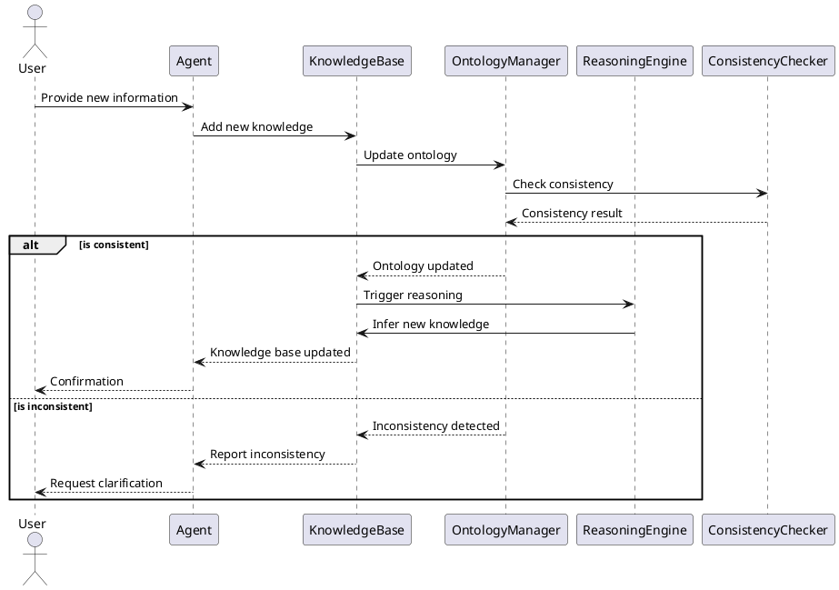
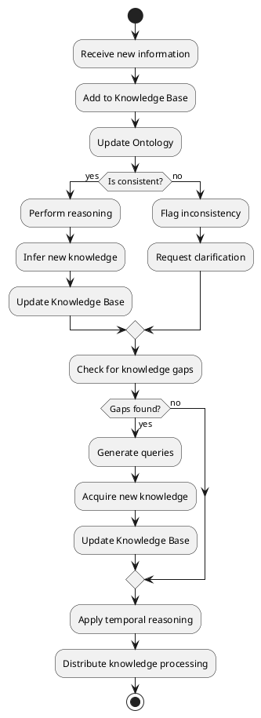
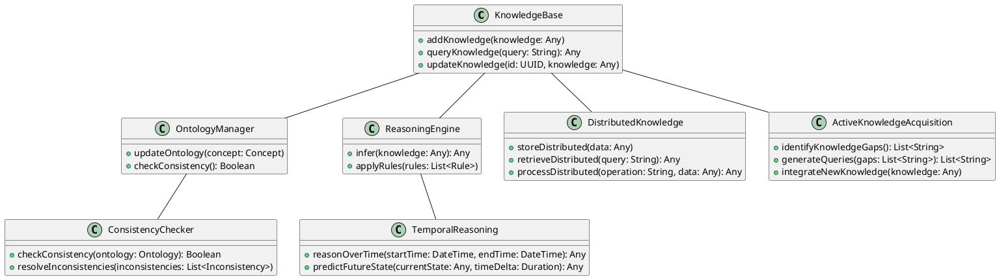
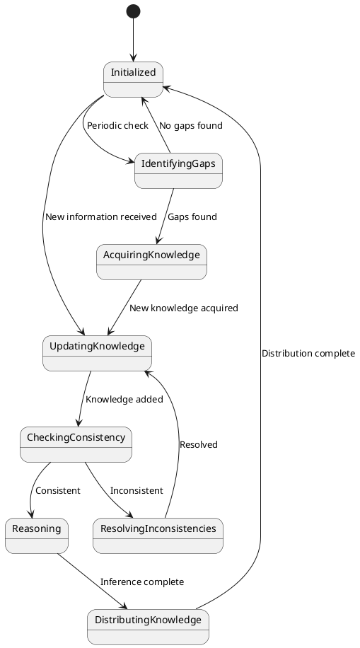
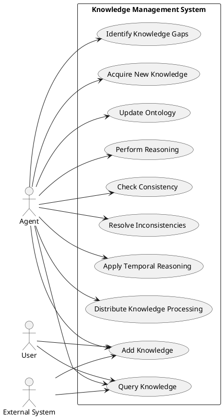

# MABOS: Constructionist Knowledge Management Features

## Table of Contents
1. [Introduction](#introduction)
2. [Key Components](#key-components)
3. [Constructionist Knowledge Management Features](#constructionist-knowledge-management-features)
   - [Ontology-Based Knowledge Representation](#ontology-based-knowledge-representation)
   - [Dynamic Knowledge Acquisition](#dynamic-knowledge-acquisition)
   - [Distributed Knowledge Processing](#distributed-knowledge-processing)
   - [Temporal Reasoning](#temporal-reasoning)
   - [Consistency Checking](#consistency-checking)
   - [Conflict Resolution](#conflict-resolution)
   - [Explanation Generation](#explanation-generation)
4. [Integration with MABOS Components](#integration-with-mabos-components)
5. [Usage Examples](#usage-examples)
6. [Future Enhancements](#future-enhancements)

## Introduction

The Multi-Agent Business Operating System (MABOS) incorporates advanced constructionist knowledge management features that enable agents to build, maintain, and utilize complex knowledge structures. These features are designed to support the dynamic and evolving nature of business knowledge, allowing the system to adapt to changing environments and requirements.

## Key Components

The constructionist knowledge management features in MABOS are implemented through several key components:


```825:838:mabos-standalone/README.md
package "Knowledge Base" {
  [Ontology]
  [Knowledge Graph]
}

package "Reasoning Engine" {
  [Inference Engine]
  [Rule-Based System]
}

[Agent] --> [Knowledge Base] : queries
[Agent] --> [Reasoning Engine] : uses
[Knowledge Base] --> [Reasoning Engine] : provides data
[Reasoning Engine] --> [Agent] : informs decisions
```


These components work together to create a robust knowledge management system that supports the constructionist approach, where knowledge is actively built and refined through agent interactions and experiences.

## Constructionist Knowledge Management Features

### Ontology-Based Knowledge Representation

MABOS uses an ontology-based approach for knowledge representation, allowing for a flexible and expressive way to model complex business domains. The ontology defines the structure and relationships of concepts, while the knowledge graph stores specific instances and their relationships.

Key features:
- Dynamic ontology updates based on new information
- Support for uncertain and probabilistic knowledge
- Integration with domain-specific business ontologies

### Dynamic Knowledge Acquisition

The Active Knowledge Acquisition component enables MABOS to continuously expand its knowledge base through various means:

- Interaction with human users
- Processing of structured and unstructured data sources
- Learning from agent interactions and experiences
- Integration with external knowledge bases and APIs

This feature ensures that the knowledge base remains up-to-date and relevant to the current business context.

### Distributed Knowledge Processing

MABOS implements distributed knowledge processing capabilities, allowing for efficient handling of large-scale knowledge bases:

- Parallel processing of knowledge queries
- Load balancing of knowledge-intensive tasks across multiple agents
- Distributed storage and retrieval of knowledge

This approach enhances scalability and performance, especially for complex business scenarios involving large amounts of data.

### Temporal Reasoning

The Temporal Reasoning module enables MABOS to reason about time-dependent knowledge and processes:

- Tracking of knowledge validity periods
- Reasoning about cause-and-effect relationships over time
- Prediction of future states based on historical data and trends

This feature is crucial for business planning, forecasting, and understanding the evolution of business processes over time.

### Consistency Checking

The Consistency Checker ensures that the knowledge base remains coherent and free of contradictions:

- Real-time consistency checks during knowledge updates
- Identification of conflicting information
- Suggestion of resolution strategies for inconsistencies

This feature helps maintain the integrity of the knowledge base, which is essential for reliable decision-making.

### Conflict Resolution

The Conflict Resolution component handles situations where conflicting information or goals arise:

- Detection of conflicts in goals, beliefs, or intentions
- Implementation of various conflict resolution strategies
- Learning from resolved conflicts to improve future decision-making

This feature enables MABOS to handle complex, real-world scenarios where perfect information is not always available.

### Explanation Generation

The Explanation Generator provides transparency and interpretability for the system's decisions and reasoning processes:

- Generation of human-readable explanations for agent decisions
- Tracing of reasoning chains from knowledge to conclusions
- Visualization of relevant knowledge graph segments for specific decisions

This feature enhances trust and understanding between human users and the MABOS system.

## Integration with MABOS Components

The constructionist knowledge management features are deeply integrated with other MABOS components:

- Agents use the knowledge base for decision-making and planning
- The Model-Driven Development (MDD) approach incorporates knowledge structures into generated models
- TOGAF and Tropos frameworks leverage the knowledge base for architecture and goal modeling
- The ERP system and software product line generation utilize domain knowledge for customization

## Usage Examples

Here are some examples of how to use the constructionist knowledge management features in MABOS:

1. Querying the knowledge base:

```python
knowledge_base = mabos_service.knowledge_base
results = knowledge_base.query("SELECT ?product WHERE { ?product rdf:type :Product }")
```

2. Adding new knowledge:

```python
new_knowledge = {
    "concept": "MarketTrend",
    "properties": {
        "name": "Remote Work Adoption",
        "impact": "High",
        "duration": "Long-term"
    }
}
mabos_service.active_knowledge_acquisition.add_knowledge(new_knowledge)
```

3. Performing temporal reasoning:

```python
start_time = "2023-01-01"
end_time = "2023-12-31"
forecast = mabos_service.temporal_reasoning.predict_future_state(start_time, end_time)
```

4. Resolving conflicts:

```python
conflicts = mabos_service.conflict_resolution.detect_conflicts()
resolved_conflicts = mabos_service.conflict_resolution.resolve_conflicts(conflicts)
```

5. Generating explanations:

```python
decision = {
    "action": "Expand Product Line",
    "reasoning": "Market trend analysis indicates growing demand in sector X"
}
explanation = mabos_service.explanation_generator.generate_explanation(decision)
```

## Future Enhancements

Future enhancements to the constructionist knowledge management features of MABOS may include:

1. Integration with advanced machine learning techniques for knowledge discovery
2. Enhanced natural language processing for knowledge extraction from unstructured text
3. Improved visualization tools for complex knowledge structures
4. Development of domain-specific reasoning engines for specialized business sectors
5. Integration with blockchain technology for secure and decentralized knowledge management

These constructionist knowledge management features provide MABOS with a powerful foundation for handling complex business knowledge, enabling intelligent decision-making, and supporting adaptive business processes in dynamic environments.

___

Certainly! I'll create detailed PlantUML diagrams for the knowledge management features in the context of the overall Multi-Agent System (MAS). These diagrams will illustrate the sequence of operations, activities, classes, state machine, and use cases related to knowledge management within MABOS.

1. Sequence Diagram: Knowledge Acquisition and Reasoning



2. Activity Diagram: Knowledge Management Process



3. Class Diagram: Knowledge Management Components



4. State Machine Diagram: Knowledge Base States



5. Use Case Diagram: Knowledge Management Features



These diagrams provide a comprehensive view of the knowledge management features within the MABOS system. They illustrate the sequence of operations for knowledge acquisition and reasoning, the overall knowledge management process, the class structure of the knowledge management components, the various states of the knowledge base, and the use cases for different actors interacting with the knowledge management system.

The knowledge management features are deeply integrated into the overall Multi-Agent System, as shown in the class diagram where the KnowledgeBase class interacts with various other components. This integration allows agents to leverage sophisticated knowledge representation, reasoning, and acquisition capabilities to make informed decisions and adapt to changing business environments.

For implementation details, you can refer to the following code snippets:


```18:34:mabos-standalone/app/services/mabos_service.py

class MABOSService:
    def __init__(self, erp_service: ERPService, modeling_service: ModelingService, 
                 num_agents: int, num_states: int, state_size: int, action_size: int, 
                 ontology_path: str):
        self.erp_service = erp_service
        self.modeling_service = modeling_service
        self.ontology_service = ontology_service.load_ontology(ontology_path)
        self.consistency_checker = ConsistencyChecker(knowledge_base_service, ontology_service)
        self.temporal_reasoning = TemporalReasoning(knowledge_base_service)
        self.distributed_knowledge = DistributedKnowledge(knowledge_base_service)
        self.active_knowledge_acquisition = ActiveKnowledgeAcquisition(knowledge_base_service, ontology_service)
        self.conflict_resolution = ConflictResolution(knowledge_base_service)
        self.explanation_generator = ExplanationGenerator(knowledge_base_service, ReasoningEngine)
        self.db_integration = DatabaseIntegration(knowledge_base_service, ontology_service)
        
        # Initialize the multi-agent system
```


```1:26:mabos-standalone/app/core/ontology_manager.py
from owlready2 import *
from typing import List
from app.ontology_types import OntologyStructure, QueryResult

class OntologyManager:
    def __init__(self, ontology_path: str):
        self.ontology_path = ontology_path
        self.world = World()
        self.onto = self.world.get_ontology(f"file://{ontology_path}").load()
        self.graph = self.world.as_rdflib_graph()

    def update_ontology_from_generated(self, generated_ontology: OntologyStructure):
        with self.onto:
            # Add classes
            for class_name in generated_ontology['classes']:
                if class_name not in self.onto.classes():
                    types.new_class(class_name, (Thing,))

            # Add properties
            for prop in generated_ontology['properties']:
                if prop not in self.onto.properties():
                    types.new_class(prop, (ObjectProperty,))

            # Add relationships
            for rel in generated_ontology['relationships']:
                subject = self.onto[rel['subject']]
```


These code snippets provide the foundation for implementing the knowledge management features illustrated in the diagrams.