# Multi-Agent Business Operating System (MABOS): A Comprehensive Framework for Business Development and Operations

## Table of Contents
1. [Introduction](#introduction)
2. [Key Components and Architecture](#key-components-and-architecture)
3. [Onboarding Process](#onboarding-process)
4. [Constructionist Knowledge Management Features](#constructionist-knowledge-management-features)
5. [Model Generation and TOGAF Integration](#model-generation-and-togaf-integration)
6. [ERP Application and Software Product Line Generation](#erp-application-and-software-product-line-generation)
7. [Continuous Learning and Adaptation](#continuous-learning-and-adaptation)
8. [Performance Metrics and Evaluation](#performance-metrics-and-evaluation)
9. [Security and Data Privacy](#security-and-data-privacy)
10. [Case Study: MABOS in Action](#case-study-mabos-in-action)
11. [Comparison with Traditional Approaches](#comparison-with-traditional-approaches)
12. [Future Enhancements](#future-enhancements)
13. [Conclusion](#conclusion)
14. [References](#references)

## 1. Introduction

The Multi-Agent Business Operating System (MABOS) is a cutting-edge framework designed for developing complex, goal-oriented, BDI (Belief-Desire-Intention) multi-agent systems tailored for business applications. MABOS combines advanced onboarding processes with constructionist knowledge management features, enabling the system to capture, represent, and utilize complex business knowledge throughout the lifecycle of creating and managing a business Multi-Agent System (MAS).

MABOS adopts a constructionist approach to knowledge management, which is particularly beneficial for business operating systems. This approach allows the system to build and refine its understanding of the business domain dynamically, much like how humans construct knowledge through experience and interaction. As a result, MABOS can adapt to unique business models, evolve with changing market conditions, and provide more accurate and relevant solutions over time.

The framework incorporates advanced features such as:
- Agent Communication Language (ACL) for structured inter-agent communication
- Large Language Model (LLM) integration for natural language processing and human-agent interaction
- Knowledge representation and reasoning capabilities
- Goal management and planning
- Belief revision and update mechanisms
- Environmental, Proactive, and Reactive agent types for comprehensive system behavior
- Model-Driven Development (MDD) approach for system design and implementation
- Integration with TOGAF (The Open Group Architecture Framework) for enterprise architecture alignment
- Incorporation of Tropos framework for agent-oriented software development

## 2. Key Components and Architecture

MABOS consists of several key components that work together to provide a comprehensive solution:

1. Onboarding Agents (OnboardingAgent, LLMAgent)
2. Knowledge Base (Ontology, Knowledge Graph)
3. Reasoning Engine (Inference Engine, Rule-Based System)
4. Model Generation Tools
5. ERP Application Generator
6. Software Product Line Generator

The architecture ensures that information flows seamlessly between components, allowing for a dynamic and adaptive system. Here's a high-level overview of the MABOS architecture:

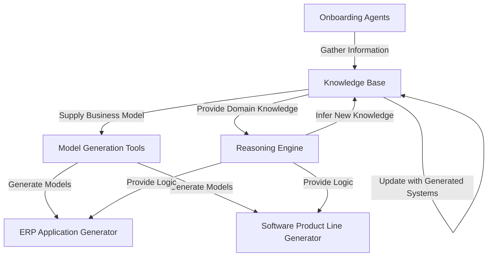

## 3. Onboarding Process

he onboarding process in MABOS is an interactive journey that begins with gathering essential information about the business and culminates in the creation of a customized MAS. Here's how each step contributes to the knowledge base:

**1. Eliciting the business vision and mission:**
    - Translates high-level goals into ontological concepts
    - Example: "Become the leading eco-friendly packaging provider" becomes concepts like "MarketLeadership" and "Sustainability"

**2. Capturing the business idea:**
    - Identifies core business entities and their relationships
    - Example: "Biodegradable packaging for e-commerce" creates entities like "Product", "Material", and "Customer"

**3. Analyzing the business model:**
    - Maps business processes and value propositions to the knowledge graph
    - Example: The "Cost Structure" in a Business Model Canvas informs the "FinancialManagement" module in the ERP

**4. Applying the TOGAF framework:**
    - Structures the gathered information according to enterprise architecture principles
    - Example: Defining the "Business Architecture" layer with processes, roles, and services

**5. Generating a live Enterprise Architecture:**
    - Creates a dynamic representation of the business structure that evolves with new information
    - Example: Automatically updating the "Technology Architecture" when new software systems are mentioned

**6. Creating a Business Model Canvas:**
    - Populates the knowledge base with key business model elements
    - Example: "Customer Segments" inform the CRM module configuration

**7. Developing Goal Models:**
    - Translates business objectives into structured, actionable goals in the knowledge base
    - Example: "Reduce packaging waste by 50%" becomes a quantifiable goal with associated metrics

Throughout this process, the system uses natural language processing and structured input forms to acquire knowledge, immediately integrating new information into the ontology and triggering reasoning processes.

The OnboardingAgent, a specialized AI entity, works in conjunction with an LLMAgent (Large Language Model Agent) to guide stakeholders through a series of carefully crafted questions. This approach ensures that the system gathers all necessary information while providing a user-friendly and interactive experience.

## 4. Constructionist Knowledge Management Features

MABOS employs sophisticated knowledge management features that enable agents to build, maintain, and utilize complex knowledge structures. These features include:

#### Ontology-Based Knowledge Representation

MABOS uses an ontology-based approach for knowledge representation, allowing for a flexible and expressive way to model complex business domains. The ontology defines the structure and relationships of concepts, while the knowledge graph stores specific instances and their relationships.

**Key features:**
- Dynamic ontology updates based on new information
- Support for uncertain and probabilistic knowledge
- Integration with domain-specific business ontologies

#### Dynamic Knowledge Acquisition

The Active Knowledge Acquisition component enables MABOS to continuously expand its knowledge base through various means:

- Interaction with human users
- Processing of structured and unstructured data sources
- Learning from agent interactions and experiences
- Integration with external knowledge bases and APIs

This feature ensures that the knowledge base remains up-to-date and relevant to the current business context.

#### Distributed Knowledge Processing

MABOS implements distributed knowledge processing capabilities, allowing for efficient handling of large-scale knowledge bases:
- Parallel processing of knowledge queries
- Load balancing of knowledge-intensive tasks across multiple agents
- Distributed storage and retrieval of knowledge

This approach enhances scalability and performance, especially for complex business scenarios involving large amounts of data.

#### Agent Reasoning

MABOS incorporates a sophisticated reasoning engine that combines multiple reasoning methods to enable intelligent decision-making and problem-solving. The `ReasoningEngine` class, implemented in `reasoning_engine.py`, orchestrates these various reasoning techniques:

**1. Rule-Based Reasoning**

The `_rule_based_reasoning` method applies predefined rules to the given context, allowing MABOS to make logical inferences based on established business rules and policies. This approach is particularly useful for enforcing compliance and maintaining consistency in decision-making processes.

**2. Probabilistic Reasoning**

MABOS employs probabilistic reasoning to handle uncertainty in business scenarios. This method allows the system to make informed decisions even when dealing with incomplete or uncertain information, which is common in real-world business environments.

**3. BDI (Belief-Desire-Intention) Reasoning**

The `_bdi_reasoning` method implements the Belief-Desire-Intention model, enabling MABOS agents to reason about their beliefs (knowledge about the world), desires (goals), and intentions (committed plans). This approach allows for goal-oriented behavior and adaptive decision-making in complex, dynamic business environments.

**4. Goal-Oriented Reasoning**

Through the `_goal_oriented_reasoning` method, MABOS can generate plans to achieve specific business goals. This capability is crucial for strategic planning and operational optimization, allowing the system to devise step-by-step action plans to reach desired outcomes.

**5. Case-Based Reasoning**

The `_case_based_reasoning` method allows MABOS to solve new problems by drawing on solutions from similar past cases. This approach is particularly valuable in domains where historical precedents can guide decision-making, such as customer service or project management.

**6. Temporal Reasoning**

Implemented in `temporal_reasoning.py`, the temporal reasoning module enables MABOS to reason about time-dependent knowledge and processes. Key capabilities include:

- Tracking validity periods of knowledge facts
- Analyzing cause-and-effect relationships over time
- Predicting future states based on historical data and trends

The `TemporalReasoning` class provides methods for reasoning over time intervals (`reason_over_time`) and predicting future states (`predict_future_state`).

**7. Uncertainty Reasoning**

The `_uncertainty_reasoning` method allows MABOS to reason with uncertain or probabilistic information, making it capable of handling real-world scenarios where complete certainty is rare.

**8. Simulation-Based Reasoning**

Through the `simulate_action` method, MABOS can predict the outcomes of potential actions in given states, enabling it to evaluate different courses of action before committing to a decision.

**9. Deductive Reasoning**

The `_deductive_reasoning` method allows MABOS to derive specific conclusions from general principles or premises. This logical approach ensures that conclusions are necessarily true if the premises are true, making it useful for tasks that require strict logical consistency.

**10. Inductive Reasoning**

The `_inductive_reasoning` method enables MABOS to generalize from specific instances or observations to broader generalizations or theories. This method is particularly useful for identifying patterns and making predictions based on empirical data.

These diverse reasoning methods are integrated within the `Reasoner` class, which provides high-level reasoning capabilities such as updating beliefs, generating desires, selecting intentions, and making decisions. The `Reasoner` leverages both symbolic reasoning (through the `SymbolicReasoner`) and LLM-based reasoning (through the `LLMReasoner`) to combine rule-based logic with the flexibility and natural language understanding of large language models.

By incorporating this comprehensive set of reasoning capabilities, MABOS enables organizations to:

- Make informed decisions based on a wide range of information and reasoning techniques
- Adapt to changing business environments by considering temporal aspects and uncertainties
- Optimize processes and strategies through goal-oriented and simulation-based reasoning
- Learn from past experiences using case-based reasoning
- Balance short-term reactivity with long-term planning through BDI-based reasoning

This multi-faceted approach to reasoning positions MABOS as a powerful tool for driving business agility, resilience, and innovation in complex, dynamic business environments.

#### Diagram

**State Machine Diagram**
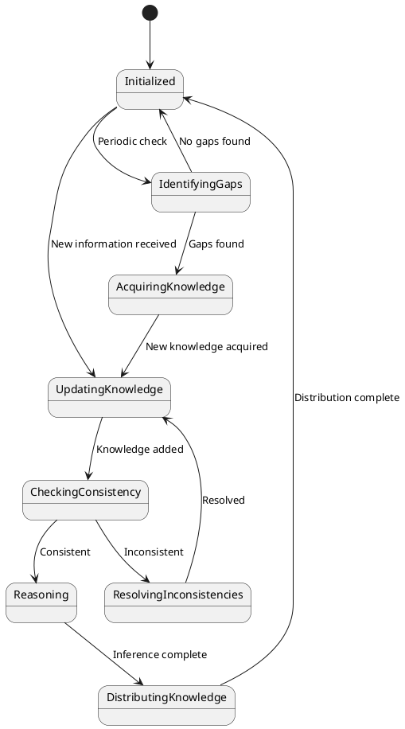

**Sequence Diagram**
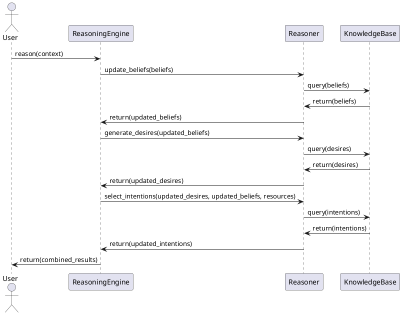

**Class Diagram**
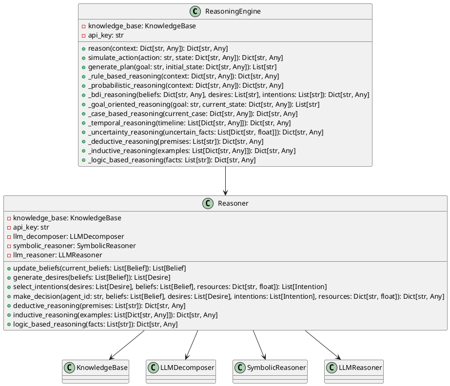

**Explanation:**
- The `ReasoningEngine` and `Reasoner` classes have been updated to include methods for deductive, inductive, and logic-based reasoning.
- The PlantUML diagrams illustrate the state machine, sequence, and class relationships within the reasoning engine.

### Agent Knowledge Inference

**Introduction**

The Multi-Agent Business Operating System (MABOS) is a sophisticated platform designed to develop complex, goal-oriented, BDI (Belief-Desire-Intention) multi-agent systems tailored for business applications. One of the core features of MABOS is its advanced inferencing capability, which allows the system to derive new knowledge from existing data by applying logical rules to the ontology. This document provides a comprehensive explanation of the inferencing capabilities of MABOS, detailing how it integrates with the related agent and knowledge management and representation components.

**Inference in MABOS**

Inference in MABOS is the process of deriving new knowledge from existing data using logical rules. This capability is crucial for enabling intelligent decision-making and problem-solving within the system. The inferencing process involves several key components:

1. **Ontology and Knowledge Graph**: The ontology defines the structure and relationships of concepts in the business domain, while the knowledge graph stores specific instances and their relationships.
2. **Reasoning Engine**: The reasoning engine applies logical rules and statistical inference to derive new knowledge from existing facts.
3. **Custom Inference Rules**: Custom inference rules are defined and applied to the ontology to infer new relationships and knowledge.

**Ontology and Knowledge Graph**

The ontology and knowledge graph are central to the knowledge representation in MABOS. The ontology defines the structure and relationships of concepts, while the knowledge graph stores specific instances and their relationships. This combination allows for flexible and powerful knowledge representation.

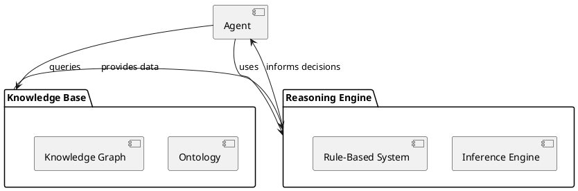

#### Reasoning Engine

The reasoning engine in MABOS combines multiple reasoning methods to enable intelligent decision-making and problem-solving. It orchestrates various reasoning techniques, including rule-based reasoning, probabilistic reasoning, BDI reasoning, goal-oriented reasoning, case-based reasoning, temporal reasoning, uncertainty reasoning, simulation-based reasoning, deductive reasoning, and inductive reasoning.

#### Custom Inference Rules

Custom inference rules are defined and applied to the ontology to infer new knowledge. These rules are implemented in the `CustomInference` class and are applied to the ontology using the `owlready2` library.


### Inference Process

**The inference process in MABOS involves several steps:**

1. **Knowledge Acquisition**: Agents continuously update their knowledge base through interactions with the environment, other agents, and external data sources.
2. **Ontology Mapping**: New information is mapped to the existing ontology, ensuring consistent interpretation across the system.
3. **Inference**: The reasoning engine applies logical rules and statistical inference to derive new knowledge from existing facts.
4. **Decision Making**: Agents use the inferred knowledge to make decisions, plan actions, and achieve goals.
5. **Learning**: The system can update its knowledge and refine its reasoning processes based on the outcomes of actions and decisions.

**Example Usage**

**Here are some examples of how to use the inferencing capabilities in MABOS:**

1. **Applying Custom Inference Rules**:

```python
from owlready2 import World
from app.custom_inference import CustomInference

world = World()
custom_inference = CustomInference(world)
custom_inference.apply_custom_inference_rules()
```

2. **Reasoning and Inferring New Knowledge**:
   ```python
   from app.models.knowledge_representation import KnowledgeRepresentation

   knowledge_rep = KnowledgeRepresentation()
   knowledge_rep.reason_and_infer()
   ```

### Integration with Other Components

The inferencing capabilities are deeply integrated with other components of MABOS, such as the `ReasoningEngine` and `KnowledgeRepresentation` classes. This integration allows agents to leverage sophisticated knowledge representation, reasoning, and acquisition capabilities to make informed decisions and adapt to changing business environments.

The inferencing capabilities of MABOS enable the system to derive new knowledge from existing data, making it a powerful tool for intelligent decision-making and problem-solving. By integrating these capabilities with the ontology, knowledge graph, and reasoning engine, MABOS provides a comprehensive solution for developing complex, goal-oriented, BDI multi-agent systems tailored for business applications.


#### Consistency Checking and Conflict Resolution

MABOS ensures that the knowledge base remains coherent and free of contradictions through real-time consistency checks and conflict resolution strategies.

#### Explanation Generation

During onboarding, MABOS provides explanations to enhance user understanding. For example:

User Input: "We want to expand to international markets."
MABOS Explanation: "Based on your current business model and the goal to expand internationally, I recommend focusing on the following areas:

1. Localization: Adapting your product for different markets
2. International Logistics: Establishing efficient supply chains
3. Regulatory Compliance: Understanding and adhering to international trade laws
These recommendations are derived from successful patterns observed in similar businesses that have expanded globally."

#### User Experience and Interface
MABOS provides an intuitive, conversational interface for the onboarding process:

- Chatbot-like interaction for natural language inputs
- Dynamic forms that adapt based on previous answers
- Visualization tools for reviewing and modifying the captured business model
- Progress indicators to show completion status of different onboarding stages

The interface is designed to be accessible to non-technical business users while still capturing detailed, structured information for the knowledge base.

## 5. Model Generation and TOGAF Integration

MABOS generates a series of interconnected models that provide a comprehensive view of the organization:

1. Business Motivation Model
2. Business Layer Model
3. Application Layer Model
4. Technology Layer Model
5. Implementation Layer Model
6. ArchiMate Model
7. Tropos Model
8. BPMN (Business Process Model and Notation) Models

The integration of The Open Group Architecture Framework (TOGAF) ensures that the resulting architecture aligns with industry standards and best practices. MABOS executes the Preliminary and Vision phases of the TOGAF Architecture Development Method (ADM), laying the groundwork for a comprehensive enterprise architecture.

Here's an activity diagram showing the model generation process:

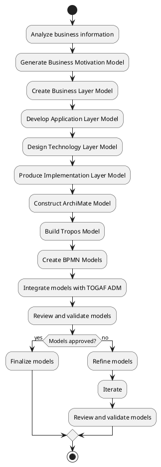

## 6. ERP Application and Software Product Line Generation

MABOS leverages a Model-Driven Development (MDD) approach to transition from high-level models to executable systems:

### ERP Application Generation

The ERP application generation process involves:
- Mapping business processes to ERP modules
- Defining data structures based on the information architecture
- Generating user interfaces aligned with business roles and responsibilities
- Implementing business rules and logic captured in the models
- Configuring integrations based on the technology architecture

### Software Product Line Generation

The MABOS (Multi-Agent Business Operating System) framework leverages a sophisticated Model-Driven Software Development approach to generate a software product line tailored to the stakeholder's business products and services. This process begins with the onboarding phase and flows through strategic, tactical, and operational levels, ensuring a close alignment between business needs and the resulting software products.

**1. Onboarding and Requirement Specification:**
During the onboarding phase, the system captures high-level business information using the Strategic Services Model (SSM). This model represents:

- Core business services
- Quality expectations
- Potential threats
- Key stakeholders and their roles
    
The SSM provides a coarse-grained, business-oriented view that serves as the foundation for the software product line.
    
**2. Model Transformation and Refinement:**
The framework then employs a series of model transformations to refine the high-level business requirements into detailed software specifications:
    
**a. Strategic to Tactical Transformation:**
    
- Services are decomposed into goals, tasks, and resources using i* models (Strategic Dependency and Strategic Rationale diagrams).
- Quality expectations are translated into softgoals.
- This step provides a more detailed view of the business processes and organizational structure.
    
**b. Tactical to Operational Transformation:**
    
- i* elements are mapped to BDI (Belief-Desire-Intention) agent concepts.
- Actors become agents, goals and tasks become plans, and resources become beliefs.
- This transformation results in a fine-grained, implementation-oriented model of the system.

## Software Product Line Generation:
Based on the operational BDI model, the system generates a software product line that includes:
    
**a. Core Asset Identification:**
 
- Common features across potential products are identified from the business domain model.
- These become reusable components in the product line.
    
**b. Variation Point Definition:**
    
- Areas where products may differ are identified based on the goal models and business strategies captured during onboarding.
- This allows for customization of products for different market segments or client needs.
    
**c. Reference Architecture Creation:**
    
- A flexible architecture is developed that can accommodate the identified commonalities and variations.
- This ensures that all products in the line share a consistent underlying structure.
    
**d. Product Derivation Mechanism:**
- Tools and processes are created to derive specific products from the product line based on particular requirements.

#### Benefits for Stakeholders:

**1. Rapid Product Development:**
The model-driven approach allows for quick generation of new products based on the established product line, significantly reducing time-to-market.

**2. Consistency Across Products:**
All products derive from the same models, ensuring consistency in quality and adherence to business goals across the product line.

**3. Customization and Flexibility:**
The identification of variation points allows easy customization of products for different market segments or specific client needs.

**4. Traceability:**
Stakeholders can trace features of any product back to the original business requirements captured during onboarding, ensuring alignment with business goals.

**5. Reduced Development Costs:**
Reuse of core assets across the product line significantly reduces development and maintenance costs.

**6. Improved Quality:**
The use of well-defined models and transformations leads to fewer errors and higher overall product quality.

**7. Easier Evolution:**
As business needs change, modifications can be made at the appropriate model level and propagated through the product line, facilitating easier evolution of the entire product family.

**8. Better Stakeholder Communication:**
The various models serve as powerful communication tools, allowing business stakeholders to understand and provide input on the software products at different levels of abstraction.

**9. Alignment with Business Strategy:**
The direct derivation from strategic models ensures that all products in the line remain aligned with overall business strategy and goals.

By leveraging this model-driven approach, stakeholders can efficiently create a family of software products that closely align with their business needs, can be rapidly adapted to market changes, and maintain a high level of quality and consistency across the product line.

## 7. Continuous Learning and Adaptation

The MABOS framework incorporates advanced continuous learning and adaptation mechanisms, leveraging Multi-Agent Reinforcement Learning (MARL) and Knowledge Graphs (KGs) to ensure that the system evolves with changing business needs and environments.

**a. Dynamic Reward Shaping:**

- Implement adaptive reward functions that evolve based on changing business goals and market conditions.
- Use extrinsic motivation and reward redistribution techniques to promote modularity and increased cooperation among agents.
- Align reward mechanisms with Quality Expectations and Threats identified in the Strategic Services Model, ensuring learning remains focused on key business objectives.

**b. Knowledge Graph-Based Learning:**

- Continuously update the Knowledge Graph with new information from business operations, market trends, and agent interactions.
- Employ multi-hop reasoning on temporal knowledge graphs to enable sophisticated inferences about changing business landscapes.
- Use attention mechanisms (like ALMARL) to help agents focus on the most relevant parts of the expanding knowledge graph.

**c. Transfer Learning and Generalization:**

- Develop mechanisms for agents to transfer knowledge across different business domains and tasks, improving adaptability to new scenarios.
- Utilize the structured nature of KGs to facilitate better generalization of learned strategies to similar but previously unseen business situations.

**d. Centralized Training with Decentralized Execution:**

- Implement a learning architecture that allows for coordinated strategy development during training phases, while maintaining independent agent actions during execution.
- This approach enables the system to learn optimal cooperative behaviors while preserving the autonomy necessary for real-world business operations.

**e. Safe Exploration in Business Environments:**

- Develop safe exploration techniques that allow agents to learn new strategies without risking critical business operations.
- Implement sandbox environments within the system where agents can experiment with new behaviors before deploying them in live business scenarios.

**f. Adaptive Communication Protocols:**

- Evolve inter-agent communication mechanisms over time to optimize information sharing and cooperation.
- Learn efficient communication policies that minimize overhead while maximizing the value of shared information.

**g. Continuous Performance Monitoring and Optimization:**

- Implement a meta-learning layer that continuously evaluates the performance of the MARL system against key business metrics.
- Automatically adjust learning parameters, model architectures, and KG structures to optimize system performance over time.

**h. Integration with Human Feedback:**

- Develop interfaces for business stakeholders to provide feedback on agent decisions and strategies.
- Incorporate this human feedback into the reward mechanisms and KG updates, allowing for a hybrid human-AI learning system.

**i. Scalable Learning Algorithms:**

- Implement efficient MARL algorithms capable of handling the increasing complexity of growing business environments and expanding agent populations.
- Utilize the KG structure to manage the dimensionality of state and action spaces, maintaining learning efficiency as the system scales.

**j. Concept Drift Detection and Adaptation:**

- Develop mechanisms to detect significant changes in the business environment or market conditions (concept drift).
- Trigger targeted relearning or model adjustments when concept drift is detected, ensuring the system remains relevant in dynamic business landscapes.

**k. Interpretable Adaptation:**

- Leverage the KG structure to provide clear, interpretable explanations of how and why the system is adapting over time.
- Develop visualization tools that allow stakeholders to track the evolution of agent strategies and the knowledge graph over time.

By incorporating these MARL and KG-based continuous learning and adaptation mechanisms, MABOS becomes a truly evolving system. It can not only respond to immediate business needs but also anticipate future challenges, continuously optimizing its performance and providing long-term value to stakeholders. This approach ensures that the software products generated by MABOS remain cutting-edge and aligned with business goals, even as those goals and the broader business environment change over time. 

## 8. Performance Metrics and Evaluation

MABOS integrates advanced Business Intelligence (BI) tools with its multi-agent system to provide comprehensive performance metrics and evaluation capabilities. This integration enables data-driven decision-making, real-time monitoring, and continuous improvement of the system's performance.

**a. Business Intelligence Integration:**

- Implement a robust BI layer that integrates data from various sources, including internal databases, external market data, and real-time operational feeds.
- Utilize ETL (Extract, Transform, Load) processes to ensure data consistency and quality across all agents and system components.
- Employ data warehousing and data lake technologies to create a centralized repository of historical and real-time data accessible to all agents.

**b. Key Performance Indicators (KPIs):**

- Define a comprehensive set of KPIs aligned with business objectives, including:
    - Strategic KPIs: High-level indicators like Return on Investment (ROI) and market share.
    - Operational KPIs: Process-specific metrics such as production efficiency and error rates.
    - Functional KPIs: Department-specific indicators like sales performance and customer satisfaction.
    - Leading and Lagging KPIs: Predictive and historical metrics to guide proactive and reactive decision-making.
- Implement real-time KPI tracking and visualization dashboards accessible to both human stakeholders and agent systems.

**c. Agent-Specific Performance Metrics:**

- Develop metrics to evaluate individual agent performance, including:
    - Goal achievement rate
    - Resource utilization efficiency
    - Decision-making speed and accuracy
    - Adaptation rate to changing conditions
- Implement agent self-evaluation mechanisms based on these metrics to enable autonomous improvement.

**d. System-Wide Evaluation:**

- Establish metrics for evaluating the overall multi-agent system performance, such as:
    - Inter-agent cooperation efficiency
    - System responsiveness to environmental changes
    - Overall goal alignment with business objectives
    - Scalability and performance under varying loads
- Utilize BI tools to analyze system-wide patterns and identify areas for improvement.

**e. Continuous Learning and Adaptation Metrics:**

- Implement metrics to assess the effectiveness of the MARL (Multi-Agent Reinforcement Learning) components:
    - Learning rate and convergence speed
    - Exploration vs. exploitation balance
    - Knowledge transfer efficiency between agents and tasks
- Track the evolution and utility of the Knowledge Graph over time.

**f. Business Impact Assessment:**

- Develop metrics to quantify the business impact of the MABOS system:
    - Cost savings and efficiency gains
    - Revenue increase attributable to system insights
    - Improvement in customer satisfaction and retention
    - Competitive advantage metrics

**g. Real-Time Analytics and Alerting:**

- Implement real-time analytics to process streaming data from various sources.
- Set up an intelligent alerting system that notifies relevant agents or human stakeholders of significant events or deviations from expected performance.

**h. Predictive Analytics:**

- Utilize the BI layer's predictive analytics capabilities to forecast future performance trends.
- Enable agents to use these predictions in their decision-making processes, promoting proactive management.

**i. Performance Visualization:**

- Develop interactive dashboards and reports that visualize performance metrics at various levels of granularity.
- Implement drill-down capabilities to allow stakeholders to investigate performance issues from high-level KPIs down to individual agent actions.

**j. Benchmarking and Comparative Analysis:**

- Integrate industry benchmarks and competitor data to provide context for performance evaluation.
- Implement comparative analysis tools to assess MABOS performance against traditional systems or industry standards.

**k. Automated Reporting and Insights Generation:**

- Develop AI-driven reporting systems that can autonomously generate insights and recommendations based on performance data.
- Enable natural language querying of performance data for easy access to insights.

**l. Compliance and Audit Trail:**

- Implement comprehensive logging and audit trail mechanisms to ensure transparency and accountability in decision-making processes.
- Develop metrics to assess compliance with regulatory requirements and internal policies.

**m. Feedback Loop Integration:**

- Establish mechanisms to incorporate stakeholder feedback into the performance evaluation process.
- Implement adaptive KPI weighting systems that can adjust the importance of different metrics based on changing business priorities.

By integrating these comprehensive performance metrics and evaluation mechanisms, MABOS provides a robust framework for continuous monitoring, assessment, and improvement of both individual agents and the overall multi-agent system. This data-driven approach ensures that the system remains aligned with business objectives, adapts to changing conditions, and delivers measurable value to stakeholders. The combination of BI tools with the goal-oriented BDI multi-agent architecture creates a powerful synergy, enabling more informed decision-making and driving business success in complex, dynamic environments.

## 9. Security and Data Privacy

MABOS prioritizes the security and privacy of business information through:
- End-to-end encryption for all data transmission
- Role-based access control for different levels of system access
- Data anonymization techniques for analytics and machine learning processes
- Compliance with GDPR, CCPA, and other relevant data protection regulations
- Regular security audits and penetration testing


## 10. Comparison with Traditional Approaches

[Provide a comprehensive comparison between MABOS and traditional business operating systems, highlighting the advantages and potential challenges of the MABOS approach.]

## 11. Future Enhancements

Potential future enhancements for MABOS include:
1. Integration with advanced machine learning techniques for knowledge discovery
2. Enhanced natural language processing for knowledge extraction from unstructured text
3. Improved visualization tools for complex knowledge structures
4. Development of domain-specific reasoning engines for specialized business sectors
5. Integration with blockchain technology for secure and decentralized knowledge management

## 12. Conclusion

MABOS represents a paradigm shift in how businesses are developed and deployed. By leveraging a sophisticated onboarding process, advanced model-driven development techniques, and a multi-agent system approach, MABOS can rapidly generate both ERP applications and software product lines tailored to specific business needs.

The integration of enterprise architecture frameworks like TOGAF, combined with AI-driven agents and model-driven development, positions MABOS as a powerful tool for organizations looking to leverage technology for competitive advantage. As businesses continue to face pressure to innovate and adapt quickly, platforms like MABOS will play an increasingly crucial role in enabling agile, technology-driven business development.

## 14. References

[Include a comprehensive list of academic and industry references supporting the concepts and methodologies used in MABOS.]


---
# Multi-Agent Business Operating System (MABOS): A Comprehensive Framework for Business Development and Operations

[Table of Contents remains the same]

## 1. Introduction

[Introduction content remains the same]

## 2. Key Components and Architecture

[Existing content remains]

Here's a high-level class diagram of the MABOS architecture:

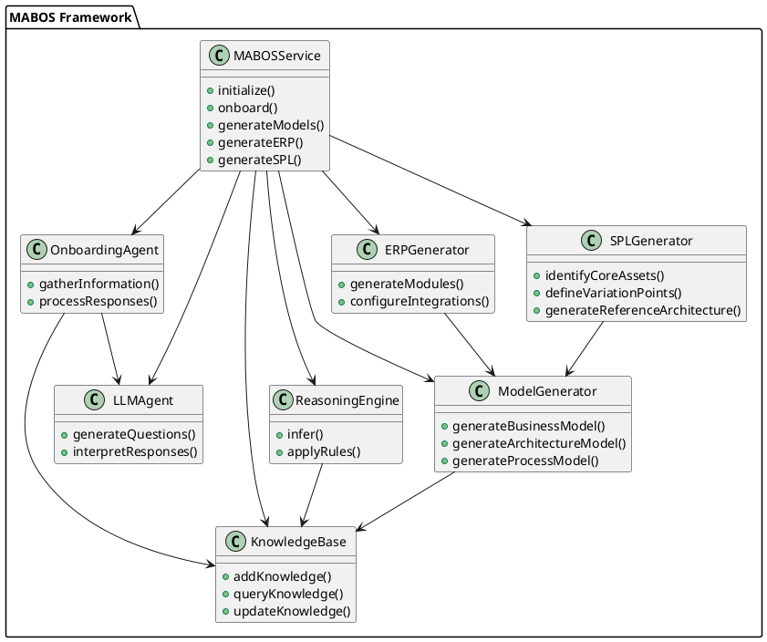

## 3. Onboarding Process

[Existing content remains]

Here's a sequence diagram illustrating the onboarding process:

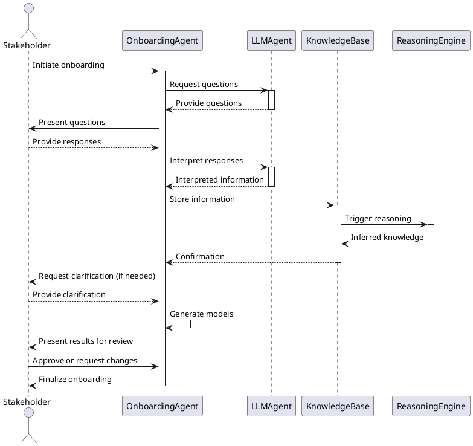

## 4. Constructionist Knowledge Management Features

Here's a state machine diagram illustrating the knowledge management process:


## 5. Model Generation and TOGAF Integration

[Existing content remains]

Here's an activity diagram showing the model generation process:

```plantuml
@startuml
start
:Analyze business information;
:Generate Business Motivation Model;
:Create Business Layer Model;
:Develop Application Layer Model;
:Design Technology Layer Model;
:Produce Implementation Layer Model;
:Construct ArchiMate Model;
:Build Tropos Model;
:Create BPMN Models;
:Integrate models with TOGAF ADM;
:Review and validate models;
if (Models approved?) then (yes)
  :Finalize models;
else (no)
  :Refine models;
  backward:Iterate;
endif
stop
@enduml
```

## 6. ERP Application and Software Product Line Generation

[Existing content remains]

Here's a use case diagram for the ERP and SPL generation:

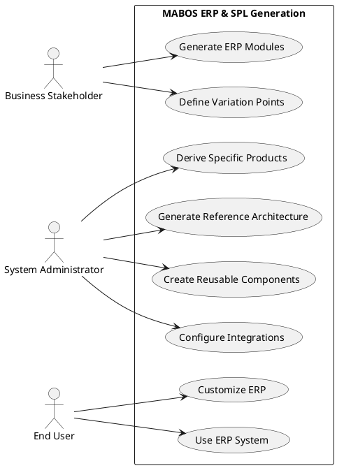

## 7. Continuous Learning and Adaptation

[Existing content remains]

Here's a sequence diagram illustrating the continuous learning process:

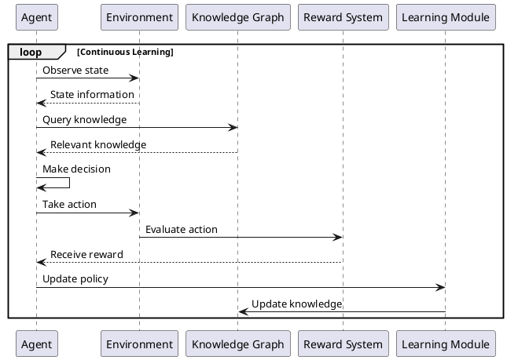

## 8. Performance Metrics and Evaluation

[Existing content remains]

Here's a class diagram for the performance evaluation components:

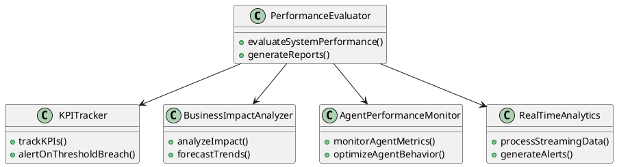

## 9. Security and Data Privacy

[Existing content remains]

## 10. Case Study: MABOS in Action

[Case study content to be added]

## 11. Comparison with Traditional Approaches

[Comparison content to be added]

## 12. Future Enhancements

[Existing content remains]

## 13. Conclusion

[Conclusion content remains]

## 14. References

[References to be added]
