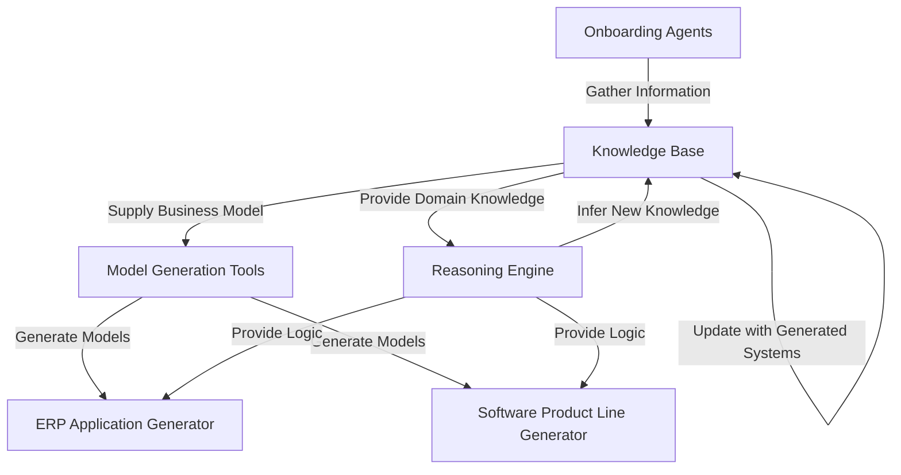

# MABOS: Comprehensive Knowledge Management and Onboarding Experience

## Table of Contents

1. [Introduction](notion://www.notion.so/kinglerdesign/06fc9edc97c5423281b909095cfbe00f?showMoveTo=true&saveParent=true#introduction)
2. [Key Components and Architecture](notion://www.notion.so/kinglerdesign/06fc9edc97c5423281b909095cfbe00f?showMoveTo=true&saveParent=true#key-components-and-architecture)
3. [Onboarding Process](notion://www.notion.so/kinglerdesign/06fc9edc97c5423281b909095cfbe00f?showMoveTo=true&saveParent=true#onboarding-process)
4. [Constructionist Knowledge Management Features](notion://www.notion.so/kinglerdesign/06fc9edc97c5423281b909095cfbe00f?showMoveTo=true&saveParent=true#constructionist-knowledge-management-features)
5. [User Experience and Interface](notion://www.notion.so/kinglerdesign/06fc9edc97c5423281b909095cfbe00f?showMoveTo=true&saveParent=true#user-experience-and-interface)
6. [Integration and Customization](notion://www.notion.so/kinglerdesign/06fc9edc97c5423281b909095cfbe00f?showMoveTo=true&saveParent=true#integration-and-customization)
7. [Security and Data Privacy](notion://www.notion.so/kinglerdesign/06fc9edc97c5423281b909095cfbe00f?showMoveTo=true&saveParent=true#security-and-data-privacy)
8. [ERP Application and Software Product Line Generation](notion://www.notion.so/kinglerdesign/06fc9edc97c5423281b909095cfbe00f?showMoveTo=true&saveParent=true#erp-application-and-software-product-line-generation)
9. [Continuous Learning and Adaptation](notion://www.notion.so/kinglerdesign/06fc9edc97c5423281b909095cfbe00f?showMoveTo=true&saveParent=true#continuous-learning-and-adaptation)
10. [Performance Metrics and Evaluation](notion://www.notion.so/kinglerdesign/06fc9edc97c5423281b909095cfbe00f?showMoveTo=true&saveParent=true#performance-metrics-and-evaluation)
11. [Case Study: MABOS in Action](notion://www.notion.so/kinglerdesign/06fc9edc97c5423281b909095cfbe00f?showMoveTo=true&saveParent=true#case-study-mabos-in-action)
12. [Comparison with Traditional Approaches](notion://www.notion.so/kinglerdesign/06fc9edc97c5423281b909095cfbe00f?showMoveTo=true&saveParent=true#comparison-with-traditional-approaches)
13. [Future Enhancements](notion://www.notion.so/kinglerdesign/06fc9edc97c5423281b909095cfbe00f?showMoveTo=true&saveParent=true#future-enhancements)

## 1. Introduction

The Multi-Agent Business Operating System (MABOS) is a cutting-edge platform that combines advanced onboarding processes with constructionist knowledge management features. This integration enables the system to capture, represent, and utilize complex business knowledge throughout the lifecycle of creating and managing a business Multi-Agent System (MAS).

MABOS adopts a constructionist approach to knowledge management, which is particularly beneficial for business operating systems. This approach allows the system to build and refine its understanding of the business domain dynamically, much like how humans construct knowledge through experience and interaction. As a result, MABOS can adapt to unique business models, evolve with changing market conditions, and provide more accurate and relevant solutions over time.

## 2. Key Components and Architecture

MABOS consists of several key components that work together to provide a comprehensive solution:

1. Onboarding Agents (OnboardingAgent, LLMAgent)
2. Knowledge Base (Ontology, Knowledge Graph)
3. Reasoning Engine (Inference Engine, Rule-Based System)
4. Model Generation Tools
5. ERP Application Generator
6. Software Product Line Generator

Here's a diagram illustrating how these components interact during the onboarding process:



This architecture ensures that information flows seamlessly between components, allowing for a dynamic and adaptive system.

## 3. Onboarding Process

The onboarding process in MABOS is an interactive journey that begins with gathering essential information about the business and culminates in the creation of a customized MAS. Here's how each step contributes to the knowledge base:

1. Eliciting the business vision and mission:
    - Translates high-level goals into ontological concepts
    - Example: "Become the leading eco-friendly packaging provider" becomes concepts like "MarketLeadership" and "Sustainability"
2. Capturing the business idea:
    - Identifies core business entities and their relationships
    - Example: "Biodegradable packaging for e-commerce" creates entities like "Product", "Material", and "Customer"
3. Analyzing the business model:
    - Maps business processes and value propositions to the knowledge graph
    - Example: The "Cost Structure" in a Business Model Canvas informs the "FinancialManagement" module in the ERP
4. Applying the TOGAF framework:
    - Structures the gathered information according to enterprise architecture principles
    - Example: Defining the "Business Architecture" layer with processes, roles, and services
5. Generating a live Enterprise Architecture:
    - Creates a dynamic representation of the business structure that evolves with new information
    - Example: Automatically updating the "Technology Architecture" when new software systems are mentioned
6. Creating a Business Model Canvas:
    - Populates the knowledge base with key business model elements
    - Example: "Customer Segments" inform the CRM module configuration
7. Developing Goal Models:
    - Translates business objectives into structured, actionable goals in the knowledge base
    - Example: "Reduce packaging waste by 50%" becomes a quantifiable goal with associated metrics

Throughout this process, the system uses natural language processing and structured input forms to acquire knowledge, immediately integrating new information into the ontology and triggering reasoning processes.

## 4. Constructionist Knowledge Management Features

### Ontology-Based Knowledge Representation

MABOS uses an ontology-based approach for knowledge representation. Here's an example of how a business concept is represented:

```rdf
:EcoFriendlyPackaging a owl:Class ;
    rdfs:subClassOf :Product ;
    :hasMaterial :BiodegradableMaterial ;
    :hasProperty :Sustainability .

:BiodegradableMaterial a owl:Class ;
    rdfs:subClassOf :Material ;
    :hasProperty :Compostable .

```

This representation allows for flexible and expressive modeling of complex business domains.

### Dynamic Knowledge Acquisition

During onboarding, MABOS uses various mechanisms for knowledge acquisition:

- Natural Language Processing: Analyzes free-text responses to extract key concepts and relationships
- Structured Input Forms: Gathers specific data points in a standardized format
- External Data Integration: Connects to industry databases to supplement business-specific information

### Distributed Knowledge Processing

As business complexity grows, MABOS scales its knowledge processing capabilities:

- Parallel Query Processing: Distributes complex queries across multiple nodes
- Sharded Knowledge Base: Partitions the knowledge base for efficient storage and retrieval
- Load-Balanced Reasoning: Distributes inference tasks to maintain performance under heavy loads

### Temporal Reasoning

MABOS applies temporal reasoning to various business scenarios. For example, during onboarding, when a business owner mentions plans for expansion:

```python
current_state = {"employees": 50, "locations": 2}
expansion_plan = {"timeframe": "2 years", "target_employees": 100, "target_locations": 5}

future_state = temporal_reasoning.project_state(current_state, expansion_plan)
# Result: {"employees": 100, "locations": 5, "timestamp": "2025-07-10"}

```

This projection can then inform resource planning and goal setting in the generated ERP system.

### Consistency Checking and Conflict Resolution

When an inconsistency is detected during onboarding, MABOS takes the following steps:

1. Identify the conflicting information
2. Present the conflict to the user with context
3. Offer potential resolutions based on existing knowledge
4. Allow the user to choose a resolution or provide additional information
5. Update the knowledge base with the resolved information

### Explanation Generation

During onboarding, MABOS provides explanations to enhance user understanding. For example:

User Input: "We want to expand to international markets."
MABOS Explanation: "Based on your current business model and the goal to expand internationally, I recommend focusing on the following areas:

1. Localization: Adapting your product for different markets
2. International Logistics: Establishing efficient supply chains
3. Regulatory Compliance: Understanding and adhering to international trade laws
These recommendations are derived from successful patterns observed in similar businesses that have expanded globally."

## 5. User Experience and Interface

MABOS provides an intuitive, conversational interface for the onboarding process:

- Chatbot-like interaction for natural language inputs
- Dynamic forms that adapt based on previous answers
- Visualization tools for reviewing and modifying the captured business model
- Progress indicators to show completion status of different onboarding stages

The interface is designed to be accessible to non-technical business users while still capturing detailed, structured information for the knowledge base.

## 6. Integration and Customization

MABOS is designed to handle unique or non-standard business models through its flexible ontology-based approach. During onboarding, if a business presents a model that doesn't fit standard templates, the system:

1. Identifies the unique elements
2. Proposes new ontological concepts and relationships
3. Validates these with the user
4. Integrates the new concepts into the existing knowledge structure

For integration with existing systems, MABOS offers:

- API-based connectors for common business software
- Data import tools for legacy systems
- Custom integration services for complex ecosystems

## 7. Security and Data Privacy

MABOS prioritizes the security and privacy of business information:

- End-to-end encryption for all data transmission
- Role-based access control for different levels of system access
- Data anonymization techniques for analytics and machine learning processes
- Compliance with GDPR, CCPA, and other relevant data protection regulations
- Regular security audits and penetration testing

## 8. ERP Application and Software Product Line Generation

The knowledge captured during onboarding directly influences the structure and features of the generated ERP and software product line. A key feature of MABOS is its ability to dynamically create ERP modules based on the specific business domain requirements.

### ERP Application Generation

MABOS analyzes the business domain knowledge acquired during onboarding to determine which ERP modules are necessary and how they should be structured. This dynamic approach ensures that the generated ERP system is tailored to the specific needs of the business, avoiding unnecessary complexity and focusing on essential functionalities.

Here's how the process works:

1. Domain Analysis: MABOS examines the ontology and knowledge graph built during onboarding to identify key business processes, entities, and requirements.
2. Module Identification: Based on the domain analysis, MABOS determines which ERP modules are needed. These aren't pre-built modules, but rather dynamically generated based on the business needs.
3. Module Generation: For each identified module, MABOS generates the necessary data structures, business logic, and user interfaces.
4. Inter-module Integration: MABOS establishes the required connections between modules to ensure smooth data flow and process integration.
5. Customization: Any unique requirements identified during onboarding are incorporated into the relevant modules.

Example: A sustainable packaging company

Let's say during onboarding, MABOS identified the following key aspects of the business:

- Eco-friendly material sourcing and inventory management
- Sustainable production processes
- Carbon footprint tracking
- Specialized customer relationships focused on sustainability goals

Based on this, MABOS might dynamically generate the following modules:

1. Sustainable Inventory Management:
    - Features for tracking eco-friendly materials
    - Supplier sustainability ratings
    - Inventory carbon footprint calculations
2. Green Production Management:
    - Energy-efficient production scheduling
    - Waste reduction tracking
    - Circular economy process modeling
3. Environmental Impact Analytics:
    - Carbon footprint tracking across the supply chain
    - Sustainability KPI dashboards
    - Environmental compliance reporting
4. Eco-Conscious CRM:
    - Customer sustainability goal tracking
    - Green product recommendation engine
    - Sustainability impact reports for customers
5. Sustainable Finance:
    - Green investment tracking
    - Environmental cost-benefit analysis tools
    - Sustainability-linked budgeting

Each of these modules is created from scratch based on the specific needs identified during onboarding, rather than being adapted from pre-existing templates. This ensures that the ERP system precisely matches the company's unique sustainable packaging business model.

## Software Product Line Generation using Model-Driven Development

The MABOS (Multi-Agent Business Operating System) framework leverages a sophisticated Model-Driven Software Development approach to generate a software product line tailored to the stakeholder's business products and services. This process begins with the onboarding phase and flows through strategic, tactical, and operational levels, ensuring a close alignment between business needs and the resulting software products.

1. Onboarding and Requirement Specification:
During the onboarding phase, the system captures high-level business information using the Strategic Services Model (SSM). This model represents:
    - Core business services
    - Quality expectations
    - Potential threats
    - Key stakeholders and their roles
    
    The SSM provides a coarse-grained, business-oriented view that serves as the foundation for the software product line.
    
2. Model Transformation and Refinement:
The framework then employs a series of model transformations to refine the high-level business requirements into detailed software specifications:
    
    a. Strategic to Tactical Transformation:
    
    - Services are decomposed into goals, tasks, and resources using i* models (Strategic Dependency and Strategic Rationale diagrams).
    - Quality expectations are translated into softgoals.
    - This step provides a more detailed view of the business processes and organizational structure.
    
    b. Tactical to Operational Transformation:
    
    - i* elements are mapped to BDI (Belief-Desire-Intention) agent concepts.
    - Actors become agents, goals and tasks become plans, and resources become beliefs.
    - This transformation results in a fine-grained, implementation-oriented model of the system.
3. Software Product Line Generation:
Based on the operational BDI model, the system generates a software product line that includes:
    
    a. Core Asset Identification:
    
    - Common features across potential products are identified from the business domain model.
    - These become reusable components in the product line.
    
    b. Variation Point Definition:
    
    - Areas where products may differ are identified based on the goal models and business strategies captured during onboarding.
    - This allows for customization of products for different market segments or client needs.
    
    c. Reference Architecture Creation:
    
    - A flexible architecture is developed that can accommodate the identified commonalities and variations.
    - This ensures that all products in the line share a consistent underlying structure.
    
    d. Product Derivation Mechanism:
    
    - Tools and processes are created to derive specific products from the product line based on particular requirements.

Benefits for Stakeholders:

1. Rapid Product Development:
The model-driven approach allows for quick generation of new products based on the established product line, significantly reducing time-to-market.
2. Consistency Across Products:
All products derive from the same models, ensuring consistency in quality and adherence to business goals across the product line.
3. Customization and Flexibility:
The identification of variation points allows easy customization of products for different market segments or specific client needs.
4. Traceability:
Stakeholders can trace features of any product back to the original business requirements captured during onboarding, ensuring alignment with business goals.
5. Reduced Development Costs:
Reuse of core assets across the product line significantly reduces development and maintenance costs.
6. Improved Quality:
The use of well-defined models and transformations leads to fewer errors and higher overall product quality.
7. Easier Evolution:
As business needs change, modifications can be made at the appropriate model level and propagated through the product line, facilitating easier evolution of the entire product family.
8. Better Stakeholder Communication:
The various models serve as powerful communication tools, allowing business stakeholders to understand and provide input on the software products at different levels of abstraction.
9. Alignment with Business Strategy:
The direct derivation from strategic models ensures that all products in the line remain aligned with overall business strategy and goals.

By leveraging this model-driven approach, stakeholders can efficiently create a family of software products that closely align with their business needs, can be rapidly adapted to market changes, and maintain a high level of quality and consistency across the product line.

## 9. Continuous Learning and Adaptation

The MABOS framework incorporates advanced continuous learning and adaptation mechanisms, leveraging Multi-Agent Reinforcement Learning (MARL) and Knowledge Graphs (KGs) to ensure that the system evolves with changing business needs and environments.

a. Dynamic Reward Shaping:

- Implement adaptive reward functions that evolve based on changing business goals and market conditions.
- Use extrinsic motivation and reward redistribution techniques to promote modularity and increased cooperation among agents.
- Align reward mechanisms with Quality Expectations and Threats identified in the Strategic Services Model, ensuring learning remains focused on key business objectives.

b. Knowledge Graph-Based Learning:

- Continuously update the Knowledge Graph with new information from business operations, market trends, and agent interactions.
- Employ multi-hop reasoning on temporal knowledge graphs to enable sophisticated inferences about changing business landscapes.
- Use attention mechanisms (like ALMARL) to help agents focus on the most relevant parts of the expanding knowledge graph.

c. Transfer Learning and Generalization:

- Develop mechanisms for agents to transfer knowledge across different business domains and tasks, improving adaptability to new scenarios.
- Utilize the structured nature of KGs to facilitate better generalization of learned strategies to similar but previously unseen business situations.

d. Centralized Training with Decentralized Execution:

- Implement a learning architecture that allows for coordinated strategy development during training phases, while maintaining independent agent actions during execution.
- This approach enables the system to learn optimal cooperative behaviors while preserving the autonomy necessary for real-world business operations.

e. Safe Exploration in Business Environments:

- Develop safe exploration techniques that allow agents to learn new strategies without risking critical business operations.
- Implement sandbox environments within the system where agents can experiment with new behaviors before deploying them in live business scenarios.

f. Adaptive Communication Protocols:

- Evolve inter-agent communication mechanisms over time to optimize information sharing and cooperation.
- Learn efficient communication policies that minimize overhead while maximizing the value of shared information.

g. Continuous Performance Monitoring and Optimization:

- Implement a meta-learning layer that continuously evaluates the performance of the MARL system against key business metrics.
- Automatically adjust learning parameters, model architectures, and KG structures to optimize system performance over time.

h. Integration with Human Feedback:

- Develop interfaces for business stakeholders to provide feedback on agent decisions and strategies.
- Incorporate this human feedback into the reward mechanisms and KG updates, allowing for a hybrid human-AI learning system.

i. Scalable Learning Algorithms:

- Implement efficient MARL algorithms capable of handling the increasing complexity of growing business environments and expanding agent populations.
- Utilize the KG structure to manage the dimensionality of state and action spaces, maintaining learning efficiency as the system scales.

j. Concept Drift Detection and Adaptation:

- Develop mechanisms to detect significant changes in the business environment or market conditions (concept drift).
- Trigger targeted relearning or model adjustments when concept drift is detected, ensuring the system remains relevant in dynamic business landscapes.

k. Interpretable Adaptation:

- Leverage the KG structure to provide clear, interpretable explanations of how and why the system is adapting over time.
- Develop visualization tools that allow stakeholders to track the evolution of agent strategies and the knowledge graph over time.

By incorporating these MARL and KG-based continuous learning and adaptation mechanisms, MABOS becomes a truly evolving system. It can not only respond to immediate business needs but also anticipate future challenges, continuously optimizing its performance and providing long-term value to stakeholders. This approach ensures that the software products generated by MABOS remain cutting-edge and aligned with business goals, even as those goals and the broader business environment change over time. 

## 10. Performance Metrics and Evaluation

MABOS integrates advanced Business Intelligence (BI) tools with its multi-agent system to provide comprehensive performance metrics and evaluation capabilities. This integration enables data-driven decision-making, real-time monitoring, and continuous improvement of the system's performance.

a. Business Intelligence Integration:

- Implement a robust BI layer that integrates data from various sources, including internal databases, external market data, and real-time operational feeds.
- Utilize ETL (Extract, Transform, Load) processes to ensure data consistency and quality across all agents and system components.
- Employ data warehousing and data lake technologies to create a centralized repository of historical and real-time data accessible to all agents.

b. Key Performance Indicators (KPIs):

- Define a comprehensive set of KPIs aligned with business objectives, including:
    - Strategic KPIs: High-level indicators like Return on Investment (ROI) and market share.
    - Operational KPIs: Process-specific metrics such as production efficiency and error rates.
    - Functional KPIs: Department-specific indicators like sales performance and customer satisfaction.
    - Leading and Lagging KPIs: Predictive and historical metrics to guide proactive and reactive decision-making.
- Implement real-time KPI tracking and visualization dashboards accessible to both human stakeholders and agent systems.

c. Agent-Specific Performance Metrics:

- Develop metrics to evaluate individual agent performance, including:
    - Goal achievement rate
    - Resource utilization efficiency
    - Decision-making speed and accuracy
    - Adaptation rate to changing conditions
- Implement agent self-evaluation mechanisms based on these metrics to enable autonomous improvement.

d. System-Wide Evaluation:

- Establish metrics for evaluating the overall multi-agent system performance, such as:
    - Inter-agent cooperation efficiency
    - System responsiveness to environmental changes
    - Overall goal alignment with business objectives
    - Scalability and performance under varying loads
- Utilize BI tools to analyze system-wide patterns and identify areas for improvement.

e. Continuous Learning and Adaptation Metrics:

- Implement metrics to assess the effectiveness of the MARL (Multi-Agent Reinforcement Learning) components:
    - Learning rate and convergence speed
    - Exploration vs. exploitation balance
    - Knowledge transfer efficiency between agents and tasks
- Track the evolution and utility of the Knowledge Graph over time.

f. Business Impact Assessment:

- Develop metrics to quantify the business impact of the MABOS system:
    - Cost savings and efficiency gains
    - Revenue increase attributable to system insights
    - Improvement in customer satisfaction and retention
    - Competitive advantage metrics

g. Real-Time Analytics and Alerting:

- Implement real-time analytics to process streaming data from various sources.
- Set up an intelligent alerting system that notifies relevant agents or human stakeholders of significant events or deviations from expected performance.

h. Predictive Analytics:

- Utilize the BI layer's predictive analytics capabilities to forecast future performance trends.
- Enable agents to use these predictions in their decision-making processes, promoting proactive management.

i. Performance Visualization:

- Develop interactive dashboards and reports that visualize performance metrics at various levels of granularity.
- Implement drill-down capabilities to allow stakeholders to investigate performance issues from high-level KPIs down to individual agent actions.

j. Benchmarking and Comparative Analysis:

- Integrate industry benchmarks and competitor data to provide context for performance evaluation.
- Implement comparative analysis tools to assess MABOS performance against traditional systems or industry standards.

k. Automated Reporting and Insights Generation:

- Develop AI-driven reporting systems that can autonomously generate insights and recommendations based on performance data.
- Enable natural language querying of performance data for easy access to insights.

l. Compliance and Audit Trail:

- Implement comprehensive logging and audit trail mechanisms to ensure transparency and accountability in decision-making processes.
- Develop metrics to assess compliance with regulatory requirements and internal policies.

m. Feedback Loop Integration:

- Establish mechanisms to incorporate stakeholder feedback into the performance evaluation process.
- Implement adaptive KPI weighting systems that can adjust the importance of different metrics based on changing business priorities.

By integrating these comprehensive performance metrics and evaluation mechanisms, MABOS provides a robust framework for continuous monitoring, assessment, and improvement of both individual agents and the overall multi-agent system. This data-driven approach ensures that the system remains aligned with business objectives, adapts to changing conditions, and delivers measurable value to stakeholders. The combination of BI tools with the goal-oriented BDI multi-agent architecture creates a powerful synergy, enabling more informed decision-making and driving business success in complex, dynamic environments.